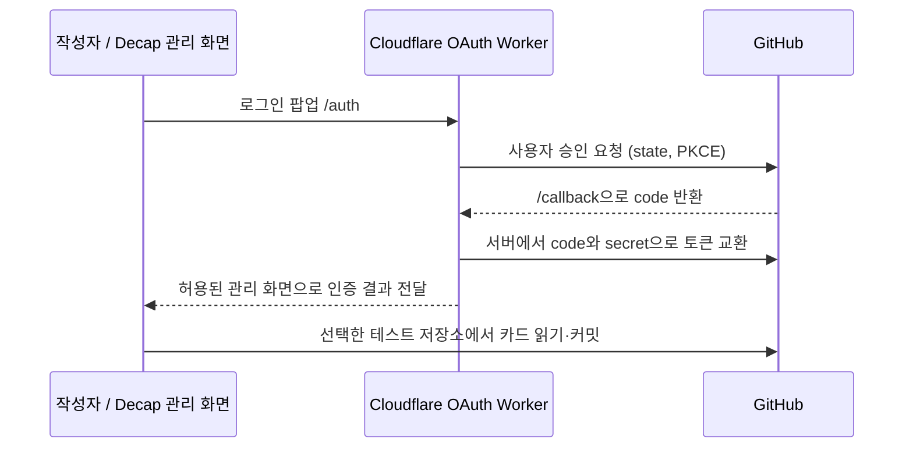

# Fragment 외부 인증 연결 준비

확인일: 2026-09-12. A03-4 설계에 이어 A04-1의 인증 서버 구현·로컬 검증을 완료했다. 계정 생성·외부 배포·실제 로그인·GitHub 저장은 아직 수행하지 않았다. 실행 가능한 최신 설정은 [Worker 실행 안내](../../workers/fragment-oauth/README.md)를 기준으로 한다. 아래 후보 비교와 계정 설정 절차는 유지한다.

## 권장 구성

**GitHub Pages는 유지하고, Cloudflare Workers Free에 GitHub OAuth 중계 서버를 두는 방안**을 권장한다. PC를 계속 켜둘 필요가 없고, 현재 Decap의 `github` backend를 유지할 수 있다. Cloudflare는 로그인 제공자가 아니라 인증 코드를 토큰으로 교환하는 서버의 실행 장소이며, 작성자는 GitHub 계정으로 로그인한다. 이 권장은 아래 자료와 현재 프로젝트 구조에 따른 설계 판단이다. Worker 코드는 A04-1에서 로컬 검증했다.



OAuth 중계 서버가 모든 콘텐츠 쓰기를 대행하는 구조는 아니다. 인증 후 Decap이 사용자 토큰으로 GitHub API를 호출한다. `github` backend 작성자는 대상 저장소의 push 권한이 필요하다. [Decap GitHub backend](https://decapcms.org/docs/github-backend/)

## 후보 비교와 비용

아래 금액은 확인일의 USD 공시 기준이며 실제 가입 시 요금표를 다시 확인한다.

| 후보 | 필요한 계정·설정 | 비용 기준 | 판단 |
| --- | --- | --- | --- |
| Cloudflare Workers + 직접 OAuth 중계 | GitHub OAuth App, Cloudflare 계정, Worker 코드·Secrets | Free: 일 100,000 요청, 호출당 CPU 10ms. Paid: 월 최소 $5와 초과 사용료 | 권장. 인증만 별도 운영 가능. Decap 팝업 프로토콜·오류 처리를 직접 검증해야 함 |
| Netlify의 GitHub OAuth provider | GitHub OAuth App, Netlify 계정·프로젝트, 프로젝트 OAuth 설정 | Free: 월 300 credits. Personal $9/월, Pro $20/월부터. 프로젝트 배포·요청 등의 사용량 공유 | 관리형 중계 대안. 우선 Netlify의 별도 테스트 관리 화면에서 연결 검증. GitHub Pages 관리 화면과의 도메인 연결은 별도 인수 |
| Netlify Identity + Git Gateway | Netlify 계정·프로젝트·Identity·Git Gateway | Identity는 credit 기반 요금제에 추가 비용 없이 포함 | 신규 구성 비권장. Git Gateway가 deprecated이며 기능 버그 수정 중단 |

비용 근거: [Workers 요금](https://developers.cloudflare.com/workers/platform/pricing/), [Netlify 요금](https://www.netlify.com/pricing/), [Identity 요금](https://docs.netlify.com/manage/security/secure-access-to-sites/identity/usage-and-billing/). 인증 트래픽이 Free 한도 안에 들 것으로 예상하지만 아직 측정하지 않았다. 별도 유료 도메인은 첫 실험에 필요하지 않으며 Cloudflare 제공 주소로 시작하는 설계다.

**Identity와 Git Gateway의 상태를 구분한다.** Identity는 2026-02-19 공지 수정으로 지원 유지가 확인되지만 Git Gateway는 여전히 신규 구성이 권장되지 않는다. 이는 Netlify의 별도 GitHub OAuth provider 서비스가 폐지되었다는 뜻이 아니다. [Identity 공지](https://www.netlify.com/blog/auth0-extension-identity-changes/), [Git Gateway 상태](https://docs.netlify.com/manage/security/secure-access-to-sites/git-gateway/), [OAuth provider 안내](https://docs.netlify.com/manage/security/secure-access-to-sites/oauth-provider-tokens/)

Decap 공식 목록에는 Cloudflare Pages용 커뮤니티 구현도 있다. 이는 Workers용으로 즉시 배포 가능한 공식 인증 제품을 의미하지 않는다. 필요하면 참조하되 코드·라이선스·콜백 검증을 거쳐야 한다. 이번 작업에서는 외부 구현을 복사하거나 설치하지 않았다. [외부 OAuth 구현 목록](https://decapcms.org/docs/external-oauth-clients/), [Cloudflare Pages 예제 원본](https://github.com/i40west/netlify-cms-cloudflare-pages)

## GitHub 권한

- 공개 테스트 저장소에는 `auth_scope: 'public_repo'`를 명시한다. 현재 고정한 `public/admin/vendor/decap-cms-3.16.2.js`를 확인한 결과, 일반 GitHub 로그인에서 생략하면 `repo`를 요청한다.
- `public_repo`도 지정한 저장소 하나만으로 제한되는 권한은 아니다. 사용자가 접근 가능한 다른 공개 저장소까지 범위에 들어갈 수 있다. CMS의 `repo` 설정은 토큰 자체의 접근 제한이 아니다.
- 비공개 저장소가 필요하면 `repo` 범위를 검토해야 한다. 공개·비공개 저장소에 대한 더 넓은 권한이므로 첫 실험은 공개 테스트 저장소를 권장한다.
- 카드 저장에 `workflow`, `delete_repo`, 조직 관리 권한은 요청하지 않는 설계다. 저장소별 세밀한 권한이 필요하면 GitHub App을 별도 검토한다. 기존 Decap OAuth 연결을 설정 한 줄로 대체할 수 있다고 가정하지 않는다.

범위 근거: [GitHub OAuth scopes](https://docs.github.com/en/apps/oauth-apps/building-oauth-apps/scopes-for-oauth-apps). 계정의 실제 권한, 브랜치 보호 규칙, 조직의 앱 승인 정책에 따라 로그인 후에도 쓰기가 거부될 수 있다.

## Cloudflare 연결 순서

다음은 실행 안내이며 현재 설정 완료 목록이 아니다. 사용자 계정에서 처리할 가입·비밀값 입력과 개발 작업을 구분한다.

1. **사용자:** Cloudflare 계정을 만들고 Free로 시작한다. Dashboard → Workers & Pages → Create application에서 테스트 Worker를 준비한다. 이름은 `fragment-oauth-test`를 제안한다. 생성된 HTTPS 주소를 기록한다. [Workers 시작 안내](https://developers.cloudflare.com/workers/get-started/dashboard/)
2. **사용자 또는 후속 작업:** GitHub에 운영 저장소와 별개인 `fragment-cms-auth-test` 저장소를 만든다. 아래 이름은 제안이며 아직 생성하지 않았다. `cms-test` 브랜치를 만들고 샘플 카드와 필요한 관리 화면 코드를 준비한다. 운영 Pages 배포 workflow는 테스트 저장소에 복사하지 않는다. 실험용 관리 화면은 이 저장소만 읽고 쓴다.
3. **개발 작업 A04-1:** Worker의 `/auth`, `/callback`과 Decap 연결 코드를 구현하고 로컬 테스트한다. 완성된 코드·검증 결과를 갖춘 후 테스트 Worker 배포로 진행한다. 빈 Worker를 생성한 것만으로 로그인은 동작하지 않는다.
4. **사용자:** GitHub Settings → Developer settings → OAuth Apps → New OAuth App에서 아래 값을 넣는다. Client ID를 기록하고 Client Secret을 발급한다. Device Flow는 이 웹 로그인에 필요하지 않다. [OAuth App 등록](https://docs.github.com/en/apps/oauth-apps/building-oauth-apps/creating-an-oauth-app)

| GitHub 입력 항목 | 테스트용 값 |
| --- | --- |
| Application name | `Fragment CMS Test` |
| Homepage URL | 실제 테스트 관리 화면의 전체 HTTPS URL (주소 확정 후 입력) |
| Authorization callback URL | `https://fragment-oauth-test.<계정-subdomain>.workers.dev/callback`에서 실제 Worker 주소로 치환 |

5. **사용자:** Worker → Settings → Variables and Secrets에 다음 값을 넣고 설정을 배포한다. 비밀값은 Cloudflare의 Secret 유형으로 입력한다. 이 변수 이름은 다음 구현을 위한 프로젝트 계약이며 Cloudflare가 자동 제공하는 이름이 아니다. [Workers Secrets](https://developers.cloudflare.com/workers/configuration/secrets/)

| 제안 변수 | 종류 | 내용 |
| --- | --- | --- |
| `GITHUB_CLIENT_ID` | 일반 변수 | 테스트 OAuth App의 Client ID |
| `GITHUB_CLIENT_SECRET` | Secret | 발급받은 Client Secret |
| `OAUTH_STATE_SECRET` | Secret | 구현 단계에서 생성할 충분히 무작위인 서명 키 |
| `CMS_ORIGIN` | 일반 변수 | 테스트 관리 화면 origin. 경로 없이 `https://<테스트-호스트>` |
| `OAUTH_CALLBACK_URL` | 일반 변수 | GitHub 등록값과 동일한 전체 `/callback` URL |
| `GITHUB_SCOPE` | 일반 변수 | 공개 테스트 저장소용 `public_repo` |

Secret·사용자 access token은 대화, Markdown, `public/`, Astro의 공개 환경변수, 로그에 넣지 않는다. Client ID와 URL은 비밀값이 아니다. 이 구분은 정적 사이트에서 Client Secret이 노출되지 않게 하는 연결 계약이다.

6. **개발 작업:** CMS의 테스트 설정을 아래처럼 연결한다. 이 프로젝트는 `CMS.init`에 TypeScript 객체를 전달하므로 별도 `config.yml`을 만들지 않는다. `<...>` 값은 실제 확인한 값으로 바꾸며 운영 설정의 기본값으로 사용하지 않는다.

```ts
// 설정 형태 예시. 실제 설정은 createOAuthTestConfig가 검증·생성한다.
const testBackend = {
  name: 'github',
  repo: '<테스트-소유자>/fragment-cms-auth-test',
  branch: 'cms-test',
  base_url: 'https://fragment-oauth-test.<계정-subdomain>.workers.dev',
  auth_endpoint: 'auth',
  auth_scope: 'public_repo',
};
// cmsConfig를 복제한 테스트 설정에 backend: testBackend,
// local_backend: false, load_config_file: false를 적용한다.
```

`base_url`은 인증 서버의 origin, `auth_endpoint`는 로그인 시작 경로이며 GitHub의 callback과 다르다. A04-1에서 별도 테스트 인증 모드와 필수 설정 누락 검사를 추가했다. `FRAGMENT_CMS_OAUTH_TEST=1`과 테스트 저장소·브랜치·OAuth origin을 함께 전달해야 한다. 일반 실행은 인증 준비 안내를 표시하고 기존 `dev:admin`의 격리 proxy 동작도 유지한다. 실제 계정 연결은 A04-2에서 검증한다.

## 인증 서버 구현 시 고정할 계약

다음은 A04-1의 설계 기준이다. 로컬 검증 결과와 미검증 항목은 Worker 실행 안내와 개발 기록에 구분했다.

- `/auth`는 예측 불가능한 `state`와 PKCE S256을 생성한다. `/callback`은 브라우저 세션에 결합된 state의 서명·만료·일치를 검사하고, 누락·변조·재사용을 거부한다. 구체적 저장 방식은 구현 시 정하고 테스트한다.
- code 교환 시 동일한 callback URL과 PKCE verifier를 사용한다. 로그인 취소·GitHub 오류·만료 code를 성공 토큰으로 전달하지 않는다. GitHub 공식 흐름이 이 값들을 권장한다. [GitHub 웹 OAuth 흐름](https://docs.github.com/en/apps/oauth-apps/building-oauth-apps/authorizing-oauth-apps/)
- 고정 vendor의 `authorizing:github` 핸드셰이크와 인증 결과 형식을 확인하고 브라우저에서 검증한다. 허용된 `CMS_ORIGIN`과 팝업/opener만 통신하며 임의 요청 origin을 신뢰하지 않는다. 토큰 전달에 와일드카드 origin을 사용하지 않는다.
- scope와 callback은 서버 설정으로 제한한다. 오류 응답·로그·캐시에 토큰이나 secret을 남기지 않는다.
- 현재 GitHub 등록 안내에는 만료되는 사용자 토큰이 기본 활성화되어 있다. Decap 3.16.2의 만료 후 재로그인 또는 refresh 처리는 아직 검증하지 않았다. 우선 기본값을 유지하고 만료 시 입력 보존·재인증을 인수한다. 자동 refresh 지원을 가정하거나 장기 토큰으로 조용히 바꾸지 않는다. [등록 시 토큰 설정](https://docs.github.com/en/apps/oauth-apps/building-oauth-apps/creating-an-oauth-app)

## Netlify 대안 연결

Worker 유지보수 대신 관리형 OAuth를 선택한다면 다음 순서로 별도 테스트 프로젝트에서 시작한다.

1. Netlify Free 계정을 만들고 테스트 관리 화면을 배포할 프로젝트를 준비한다. 그 관리 화면의 CMS 저장 대상은 별도 GitHub 테스트 저장소로 지정한다.
2. GitHub OAuth App을 등록한다. callback은 **`https://api.netlify.com/auth/done`**이다. Cloudflare용 `/callback` 주소와 혼용하지 않는다.
3. Netlify Project configuration → Access & security → OAuth → Authentication Providers → Install Provider에서 GitHub를 선택하고 Client ID·Client Secret을 입력한다.
4. Decap은 `name: 'github'`, 테스트 `repo`·`branch`, `auth_scope: 'public_repo'`를 사용한다. Cloudflare용 `base_url`·`auth_endpoint`는 제거하고 Netlify 기본 인증 경로를 쓴다. Identity나 Git Gateway 활성화는 이 직접 OAuth 방식의 단계가 아니다.
5. Netlify 테스트 관리 화면에서 먼저 A04를 인수한다. GitHub Pages에서 동일 OAuth 프로젝트를 사용할 경우 `site_domain` 및 허용 도메인 연결을 추가 검증해야 한다. 이번 조사로 교차 호스팅 성공을 확인한 것은 아니다.

설정 근거: [Netlify OAuth provider 설정](https://docs.netlify.com/manage/security/secure-access-to-sites/oauth-provider-tokens/), [Decap GitHub 설정](https://decapcms.org/docs/github-backend/). 관리형 인증도 고정 vendor의 토큰 만료 동작은 실제 확인해야 한다.

## 실제 저장 인수와 다음 작업

현재 운영 후보는 `avocadosmasher/avocadosmasher.github.io`의 `main`이다. 이 저장소의 `.github/workflows/deploy.yml`은 main push로 배포한다. A04는 위의 **별도 테스트 저장소·브랜치**를 대상으로 수행한다. CMS는 관리 화면이 로컬에 있어도 GitHub backend가 지정한 원격 브랜치에 저장한다. [Decap 저장 대상 규칙](https://decapcms.org/docs/configuration-options/)

| 인수 | 남길 증거 |
| --- | --- |
| 테스트 화면 로그인 | 실제 화면 URL, 로그인 결과, 실행 일시. 토큰은 기록하지 않음 |
| 새 카드 저장 | 테스트 저장소의 커밋 URL·SHA, 파일 경로·ID |
| 다른 브라우저 세션에서 재로그인·읽기 | 저장한 title·summary·body 일치 |
| 같은 카드 수정 | 새 커밋, 기존 파일명·ID 유지 |
| 취소·권한 거부·인증 만료 | 성공으로 표시하지 않음, 입력 보존과 복구 결과 |

로그인은 성공했으나 저장이 실패하면 대상 repo/branch, 실제 쓰기 권한, 보호 규칙, 승인 scope를 확인한다. callback 실패는 등록 URL과 서버 설정, state/PKCE를 확인한다. 팝업에서 돌아오지 않으면 차단 여부와 origin·핸드셰이크를 확인한다. 단위 테스트의 mock 성공은 실제 로그인·커밋 증거가 아니다.

다음 작은 태스크는 **A04-2: 테스트 환경 배포 및 실제 로그인 → 저장 → 다른 세션 읽기**다. A04-1의 로컬 검증은 완료했다. A04 완료 전에는 G05/G07/H05나 운영 웹 편집 완료로 표시하지 않는다.

계정 설정 후 공유할 정보는 테스트 저장소명·브랜치, Worker URL, 테스트 관리 화면 URL, Secret 설정 완료 여부다. 비밀값 자체는 공유하지 않는다.
