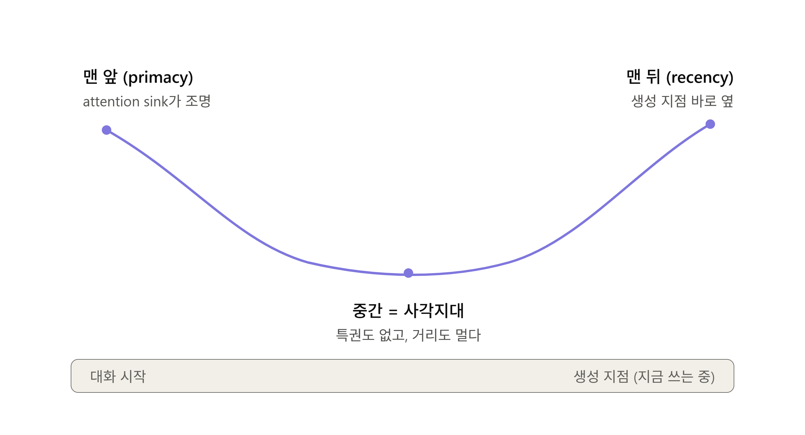

# Intro
AI 를 쓰다 보면 늘 같은 자리에서 미끄러집니다. 분명히 내가 원하는 걸 설명했는데, 결과물을 보면 "이게 아닌데"라는 생각이 들 때가 잦고 더 나쁘게는 내가 뭘 원하는지 혹은 내가 원하는 바를 이루기 위해서 어떤게 필요한지 배경 지식이 부족한 경우가 많습니다. 사람과 에이전트 사이에 알고 있는 Context의 차이, 나도 모르게 무의식적으로 "이 정도는 알겠지."하는 생각을 하거나 설명을 하는 능력의 부족으로 AI에게 미처 설명을 다 하지 못하는 경우가 많습니다.

Matt Pocock은 이 문제를 단 몇 문장짜리 프롬프트(**grill-me**)로 해결 했으며, 그게 그의 스킬 저장소에서 가장 인기 있는 스킬이 되었으며(최근에는 **grill-with-docs**로 더욱 발전된 형태가 되었다고 합니다.) 저 또한 해당 스킬을 애용하게 되었습니다. 그러나 사용을 하다보니 **grill-me**가 심플하고 좋긴 하지만 뭔가 부족하다고 느껴졌습니다(심플한 문장에서 오는 강력한 효과는 좋으나 문서화가 더디고, 한번 결정한 내용에 대한 수정에 대한 방안이 없고, 자꾸 추천을 해주지만 배경지식이 크지 않은 분야라면 그냥 무지성으로 AI 추천대로 하게 되더라구요). 이러한 문제점들을 사용중에 느낀 저는 감히! 저보다 경험이 뛰어나고 대단한 Matt Pocock씨가 만든 이 grill-me 라는 스킬을 개선해보고자 했으며 제가 불편하다고 느낀 점들을 우선적으로 반영하는 방향으로 개선해 보았습니다.

이 글은 그 `grill-me` 스킬을 AI 엔지니어링 관점에서 뜯어보고, 모델이 실제로 어떻게 동작하는지(앵커링, 맥락 소실 같은 현상)를 근거로 장단점을 짚어본 뒤, 한 단계 개선한 버전까지 직접 설계해 본 기록입니다. 개인적으로 찾아본 내용들이라 사실 낯선 개념도 많았고 해서 틀린 부분이 있을 수 있으니 양해 부탁드립니다.

---

## 1. Matt Pocock은 누구인가

Matt Pocock은 원래 TypeScript 교육자로 유명했던 인물입니다(Total TypeScript 등). 최근 몇 년은 무게 중심을 AI 엔지니어링으로 옮겨, AIHero(aihero.dev)라는 이름으로 "기준을 포기하지 않고 AI를 쓰려는 실무 개발자"를 위한 콘텐츠와 도구를 만들고 있다고 하더군요.

그가 짚은 핵심 포인트는 단순합니다. **소프트웨어 프로젝트가 망하는 가장 흔한 원인은 정렬 실패이고, AI 시대에도 이건 그대로다.** 그는 개발자가 AI Coding을 하다 보면 빠지는 두 가지 유형의 실패를 "YOLO vs OH NO"라고 부릅니다. 전부 위임해 버리고 자기가 이해하지 못하는 스파게티에 파묻히거나(YOLO), 아무것도 위임하지 않고 시스템 전체를 머리에 이고 가다 번아웃되거나(OH NO). 아무래도 둘 다 AI 시대의 뛰어난 생산성과 그 이면에 가려진 할루시네이션을 그대로 받아들이게 되는 Pain Point를 찌릅니다. 그가 제시한 해법은 가운데 길 — 자신의 작업 프로세스를 설계하고, 그것을 스킬(skill)로 인코딩해서, 에이전트가 그 레일 위를 달리게 하는 것입니다.

그 결과물이 그의 공개 저장소 `mattpocock/skills`입니다. "Real Engineers를 위한 스킬, 내 `.claude` 디렉터리에서 그대로 가져온 것"이라는 부제가 있으며 이는 그가 직접 AI를 사용하며 겪은 문제점들을 해결하고 더 나은 AI 엔지니어링을 위한 시행착오들을 공유함을 시사하고 있습니다. 그중에서도 당연코 가장 인기가 있었던 스킬 중 하나는 `grill-me`였으며 저는 이후에 다룰 글에서 이를 파헤치고 개선해보고자 합니다다.

---

## 2. `grill-me`란 어떤 스킬인가

`grill-me`은 놀랍도록 짧습니다. 원문은 아래와 같습니다.
>Interview me relentlessly about every aspect of this plan until we reach a shared understanding. Walk down each branch of the design tree, resolving dependencies between decisions one-by-one. For each question, provide your recommended answer.
>
> Ask the questions one at a time, waiting for feedback on each question before continuing. Asking multiple questions at once is bewildering.
> 
> If a _fact_ can be found by exploring the codebase, look it up rather than asking me. The _decisions_, though, are mine — put each one to me and wait for my answer.
> 
> Do not enact the plan until I confirm we have reached a shared understanding.

그 의미를 한국어로 해석하면 아래와 같습니다.

> 이 계획의 모든 측면에 대해 **공통된 이해**에 도달할 때까지 나를 **집요하게**(relentlessly) 인터뷰하라. **설계 트리**의 각 가지를 따라 내려가며 결정들 간의 의존 관계를 하나씩 해소하세요. 각 질문마다 네가 추천하는 답을 함께 제시하세요
> 
>**질문은 한 번에 하나씩** 하고, 계속하기 전에 각 질문에 대한 **피드백**을 기다리십시오. 한 번에 여러 질문을 하는 것은 당황스럽습니다.
>
  코드베이스(소스 코드)를 직접 뒤져서 알 수 있는 단순한 사실이나 정보는 사용자에게 묻지 말고 **스스로 찾아보세요**
>
>세워둔 계획이나 코드를 실제 환경에 적용(실행)하기 전에, **"우리가 같은 이해를 바탕으로 동의했다"는 사용자의 명확한 확인(Confirm)이 있을 때까지 대기**하세요

이 스킬을 사용하면 보통 45분 안팎의 깊은 인터뷰가 이어지고, 끝날 무렵엔 요구사항·의사결정·맥락이 빽빽하게 쌓인 대화가 남습니다.

흥미로운 부분은 "추천 답을 제시하라"는 부분입니다. AI가 명백히 좋은 답이 있는 질문을 던질 때 그 답을 같이 추천하게 만들면, 사용자가 매번 설명할 필요 없이 "응"만 하면 되므로 대화가 빠르게 진행되고 제가 고민할 부분이 줄어들더군요(약간 양날의 검?? 인 것 같습니다. AI 추천 답변에 너무 기대게 되는 경향이 있는 것 같습니다.).

한 가지 더. Matt 본인은 코딩 워크플로에서는 이미 `grill-me`보다 후속작인 `grill-with-docs`(혹은 domain-model)를 기본으로 권하고 있습니다. 이쪽은 인터뷰를 하면서 프로젝트 용어집(CONTEXT.md)과 의사결정 기록(ADR)을 함께 갱신하는 형태입니다. 즉 `grill-me`는 지금 "코드베이스 전체 워크플로까지는 필요 없고, 계획만 가볍게 압박 테스트하고 싶을 때 쓰는 가벼운 도구"로 재 포지셔닝 되었다고 합니다.

---

## 3. 분석 — 무엇이 영리하고, 무엇이 부족한가?

### 기계적으로 영리한 부분

`grill-me`가 잘 작동하는 이유는 LLM의 실제 동작과 정확히 맞아 떨어지기 때문이라 생각합니다.

- **한 번에 한 질문.** 모델에게 한 턴에 여러 질문을 시키면 모델도 추적을 놓치고 사용자도 일부만 답하게 됩니다. 단일 질문으로 강제하면 매 대화가 하나의 질문-답변 구조에 집중하여 답변의 질이 좋아지게 됩니다.
- **추천 답 제시.** 이건 단순한 결정의 속도 뿐만 아니라. 사용자를 _생성 모드_(백지에서 떠올리기, 느리고 어려움)에서 _평가 모드_(예/아니오 판단, 빠르고 쉬움)로 인지 부하(부담)가 내려갑니다. 동시에 모델이 자기 가정을 명시적으로 추천 답 형태로 드러내게 만들어, 사용자가 그걸 교정할 수 있게 합니다.
- **코드베이스로 답할 수 있으면 직접 탐색.**  모델이 필요시 알아서 읽으면 되는 걸 사용자에게 되물어 대화가 늘어져 사용자에게 피로도를 누적을 시킬 수 있는 흔한 짜증 패턴을 차단합니다. 토큰 경제의 문제로도 이어질 수 있다고 봅니다.
- **의존 관계 순서대로 트리 탐색.** 결정에 위상 순서를 부여합니다. 부모 결정을 마무리해야 자식 결정을 물을 수 있으며 이는 필요한 단계를 의도치 않게 명확히 하지 않고 넘어가거나 결정의 선 후 관계를 따져야 할 때 강점이 드러납니다.
- **스킬 자체의 짧음.** 과하게 명세된 스킬은 모델의 자체 추론 여지를 죽일 수 있습니다. `grill-me`는 "design tree"라는 뼈대만 주고 나머지는 모델이 알아서 사용자와의 상호작용을 통해 채우게 둠으로써 모델의 자율성을 중시합니다.

### 비어 있는 부분

- **산출물이 없어 맥락이 붕괴한다.** 긴 세션에 대한 기록이 오직 대화창에만 존재합니다. `/clear` 한 번이면 통째로 증발하고, 그렇지 않더라도 대화가 길어지면 품질이 떨어지게 됩니다. 산출물이 없는 대화가 길어지면 그 과정을 추적하기가 불편해지며 혹여나 대화 중간에 토큰 한도에 도달하거나 실수로 세션을 끊거나 하는 일이 생기면 나눴던 긴 대화가 물거품이 될 수 있습니다. 
- **추천 답의 양날성.** 답변의 추천은 속도를 높여주고 사용자에게 부담을 덜어주지만 모델과 사용자 양쪽을 한쪽으로 끌어당길 위험이 있습니다(추천 답에 의존하게 되는 경향이 사용하다 보면 생기더군요.).
- **정지 조건과 우선순위가 없다.** "공통 이해에 도달할 때까지 집요하게"는 언뜻 들으면 명료하게 들릴 수 있지만 사실 언제 멈출지가 없습니다. 되돌리기 쉬운 사소한 부분에서 시간을 끌게 될 가능성이 높습니다. 예를들어 핵심적인 부분만 완료되고 나면 나머지 자잘한 부분들은 어찌되건 상관 없더라도 이 조건으로 인해 AI는 계속해서 질문을 이어 나가며 중요하지 않은 부분에서 시간을 많이 태우게 될 가능성이 있습니다.
- **엄격한 깊이우선 탐색의 경직성.** 한 가지를 완전히 닫고 다음으로 넘어가는 방식은, 설계 트리를 따라가다 나중에 발견한 제약이 상위 결정을 뒤집어야 하는 경우를 놓치게 됩니다.

---

## 4. 개선 사전 조사 — 근거를 들고 따져 본 것들

해당 부분은 개선 작업 전 문제점이 될 수 도 있는 부분들을 따져보고 관련 논문을 찾아보며 직관으로 단정하지 않고 객관적 근거를 통한 조사? 고민? 에 대한 기록입니다.
실제로 사용해보며 모델의 행동을 살펴보며 느낀 점을 기준으로 진행했습니다(가능한 말이지요 ㅎㅎ..).

***P.S 개선된 각 부분들의 내용이 어떤 근거에 의한 결과인지 이해를 돕기 위해 중간 중간에 해당 세션에서 이루어진 핵심 고민과 조사를 바탕으로 어떤 부분을 개선 내용으로 반영을 했는지 세션별로 마지막에 단락을 남겼습니다.*** 

### 4-1 LLM의 근본적 문제 관련
#### 4-1-1  사용을 하며 든 생각 — 위화감의 원인?
`grill-me` 스킬을 실제로 사용을 하다 보면 짧게는 5~10분 정도 대화를 주고 받는 정도의 인터뷰 길게는 40분 언저리 까지도 대화가 길어지게 됩니다. 이렇게 대화를 길게 나누다 보면 묘한 위화감을 느끼게 될 때가 있습니다(확실히 좋은 모델을 쓰면 좀 덜한 것 같긴 합니다). 해당하는 위화감의 원인을 다음 2가지로 후보를 들었습니다.

첫 번째로 대화의 초반에 나눈 부분들이 더 큰 무게를 가지는 듯한 느낌 즉, 앵커링이 있는 것 같은 느낌을 받았습니다. 예를 들어 제가 AI Model에 국한되지 않는 Harness 구조를 만들어 보고 싶어 저만의 표준 Harness 구조를 만들고자 한 적이 있었습니다. 당시에 대화 초반에 제가 이전에 혼자 구상하던 Harness 구조를 주고 개선에 대한 인터뷰를 진행을 했었습니다. 그렇게 진행하다 보니 제가 생각하던 구조에서 근본적인 한계가 있다고 느꼈고? AI는 제가 그 위화감을 느끼기 전까지 어떻게든 제가 처음에 준 구조에서 크게 벗어나지 않고 개선을 하려고 하는 느낌을 받았습니다. 결국은 제가 생각하던 구조 자체는 한계가 있다고 생각해 프로젝트 자체는 접었지만 `grill-me`도 결국은 앵커링의 영향을 크게 받는 것 아닌가 하는 느낌을 받게 된 경험이었습니다.(추측하기로 설계트리의 상위에서부터 하위로 내려가도록 강제한 부분은 있지만 상위 트리에 대한 수정은 언급한 부분이 없어 그 부분을 철저하게 지켜려고 하다보니 생긴 문제가 아닐까 싶습니다.)

두 번째로 대화가 길어지다 보면 똑같은 문제를 반복할 때가 있다는 점이었습니다. 이는 흔히 알고 있는 lost-in-the-middle 즉, 망각에 의한 문제로 인한 문제로 생각이 들더군요. 대화 중간에 문제라고 정의하고 넘어갔는데도 이후에 다시 문제를 답변으로 내놓는 경우가 있는데, 이전 대화를 망각해서 생긴 문제라고 생각됩니다.

#### 4-1-2. 앵커링과 망각 — 둘 중 뭐가 더 큰 문제인가

처음 든 우려는 "추천 답이 앵커링을 일으킨다"입니다. 이런 부분은 사용자에게 뿐만 아니라 AI 모델에게도 영향을 미치지 않을까? 라는 의문이 들더군요(실제로 사용하다 보면 설계 트리에서 상위에 한 결정들은 번복을 잘 하지 않게 되고 오히려 아래 가지들을 수정하는 방향으로 나아가더군요). 이것이 단순히 저만 느끼는 부분일지 실제로 다른 사람들도 느끼는지 자료를 좀 찾아보았습니다.

 처음에 꽤 그럴듯한? 자료를 찾았습니다. 해당 자료는 "[LLM 사용시 앵커링으로 인한 편향이 존재한다.](https://arxiv.org/pdf/2412.06593)"라는 내용을 경험적으로 연구한 내용을 담고 있었습니다. 하지만 인용했던 앵커링 논문은 알고 보니 고등학교 소속 저자들이 쓴, 학술 트랙 레코드가 검증되지 않은 단일 논문이더군요(동료 심사는 거쳤지만... 그래도 좀 신뢰성이 낮아지더군요). 그래서 해당 논문에서 언급한 "강한 모델일수록 앵커링에 취약하고 무시 지시도 안 듣는다"는 주장을 그런 출처 하나에 얹는 건 옳지 않을 것이라 느꼈습니다. 그래서 다른 자료들을 찾아보기로 했습니다.

찾다보니 "LLM에 앵커링이 존재한다"는 명제 자체는 더 신뢰성이 높은 근거가 있었습니다. Erik Jones와 Jacob Steinhardt의 [_Capturing Failures of Large Language Models via Human Cognitive Biases_(NeurIPS 2022)](https://arxiv.org/pdf/2202.12299)는, 마침 맥락에 딱 맞게, OpenAI Codex가 프롬프트 프레이밍에 따라 예측 가능하게 오류를 내고 **출력을 앵커 쪽으로 끌어당긴다**는 것을 보였습니다. 다만, 논문 내에서도 어떤 연구는 GPT-3에서 다른 인지 효과는 나타나는데 앵커링은 부재했다고 합니다. 그러니 정직하게 말하자면 "**앵커링은 진지하게 고려할 만한 실재 리스크지만 보편 법칙은 아니다**"이다. 라는 결론 정도.. 일 것 같네요

반면에 "대화 도중 맥락이 소실된다"는 더 확실한 증빙 자료가 있습니다. 흔히 lost-in-the-middle 현상이라고 부르는데요(Liu 외, 2023). 정보가 컨텍스트 한가운데 있을 때 정확도가 크게 떨어지고, 이는 GPT-4·Claude를 포함한 여러 모델 계열에서 재현됩니다. 원인은 공부를 하다보니 아무래도 LLM의 아키텍처에 있는 것 같습니다. RoPE 위치 인코딩이 멀리 떨어진 토큰 간 어텐션을 감쇠시키고, attention sink 덕에 맨 앞은 살아남고 생성 지점 근처(맨 뒤)도 살아남는데, 중간 토큰은 앞의 primacy도 뒤의 recency도 못 받는 사각지대에 빠지게 되기 때문이죠.
이러한 망각 현상을 그림으로 나타내면 아래와 같은 U자형 곡선으로 나타낼 수 있습니다. 맨 처음 합의한 큰 틀과 가장 최근의 몇 마디는 비교적 살아남고(attention sink 좀 싼 표현으로 attention 짬통...), 20분쯤 지점(대강 중간 지점)에서 합의한 중간 가지 결정들이 제일 먼저 잊혀지게 됩니다.

그래서 앵커링과 망각은 **같은 위치 편향의 양면**을 뒷받침 합니다. 앞쪽(primacy+앵커링)은 과대평가되어 끈끈하게 박히고, 중간은 과소평가되어 사라지게 됩니다. 여기서 `grill-me`의 최악의 시나리오가 나타납니다. — 모델이 초반에 대한 방향성은 끝까지 살아남는데, 중간에 나눈 대화들이 후반부에 영향력이 덜할 수 있다는 거죠.

> **🔧 이를 스킬에 반영하여 개선한 부분**
> 
> ```plain-text
> For each question, give your recommended answer and your confidence.
> ... When it's a genuine trade-off, lay out the options neutrally and
> argue the strongest case against your own pick.
> ```

앵커링을 억제하기 위해 추천에 **신뢰도**를 붙이고, 트레이드 오프 결정에서는 **자기 추천의 반대편을 스스로 변호**하게 하였습니다(사용자의 비판적 사고를 더하기 위해). 망각(중간 붕괴) 쪽 대응은 `4-4`의 디스크 로그로 이어집니다.

### 4-2. 추천 답에 "나는 판단 못 한다"를 더하라

제 생각에? 사실 `grill-me`는 Matt 자신이 쓰려고 만든, 자기 수준에 맞춘 스킬이라고 생각합니다. Matt은 개발 경험이 풍부하고 평균적인 사용자들에 비해서 지적인(저보다는 지적이신) 사람이라 추천 선택지만 봐도 좋은 판단을 내릴 수 있습니다. 하지만 일반 사용자는 자기가 정확히 뭘 원하는지 조차 모르는 경우가 많고, 선택을 맡기더라도 사실 선택을 판단할 능력이 부족한 경우가 많습니다. 사실 그게 애초에 AI를 쓰는 이유가 아닐까요?

그래서 저는 추천 답에 **"나는 아직 이걸 판단할 지식이 없다"는 제3의 선택지**를 더하자는 아이디어를 생각했습니다. 이건 단순히 옵션 추가가 아니라, 스킬의 목적을 **결정 추출**에서 **사용자 이해도 진단**으로 끌어올리는? 일종의 비장의 수단 입니다.

이부분은 솔직한 사용 경험과 정확히 맞물립니다. 실제로 `grill-me`를 써 보면, 자기가 잘 아는 쉬운 부분에서는 계속 캐묻고 이야기를 늘리다가, 정작 어려운 부분이 나오면 그냥 AI 추천대로 승인 도장을 찍게 됩니다. 그런데 현실은 아주 차갑죠... 그 어려운 부분이 가장 중요한 부분인 경우가 대다수입니다. 현재 스킬은 거기서 결정을 신중히 해야하는 어려운 결정에서 빨라지고 중요도가 낮은 쉬운 결정에서 느려집니다. — 완전히 거꾸로입니다;;;

> **🔧 이를 스킬에 반영하여 개선한 부분**
> 
> ```
> Always offer a third option — "I don't have enough knowledge to decide this."
> If I take it, don't let me rubber-stamp it: either teach me briefly, or mark
> the decision as an open spike to research later.
> 
> Order questions by risk, not by ease. Surface the hardest-to-reverse,
> highest-uncertainty decisions first. Don't linger on cheap, reversible leaves.
> ```

**제3의 선택지(defer)** 를 넣어, 사용자가 모르는 채로 도장 찍는 것을 막고 이해도를 진단하였습니다.

### 4-3. 무엇을 먼저 물을 것인가 — 위험도 순 정렬과 백트래킹

앞 섹션의 "쉬운 데서 느려지고 어려운 데서 빨라진다"는 문제는 사실 3장에서 지적한 두 가지 단점 — **정지 조건·우선순위의 부재**, 그리고 **깊이우선 탐색의 경직성** — 과 같은 이유에서 나옵니다. 이 섹션에서는 이 부분에 대한 개선을 다룹니다.

**첫째, 순서 문제.** 원본은 "설계 트리를 따라 **의존 관계**를 하나씩 해소하라"고 지시합니다. 즉 정렬 기준이 **의존성**입니다. 그런데 의존성은 **"무엇이 먼저 결정되어 있는가"** 를 말할 뿐, **"무엇을 잘못 정하면 나중에 가장 골치 아파지는가(비용이 비싼가)?"** 를 말하지 않습니다. 이 둘은 자주 어긋나는 부분입니다. 되돌리기 어려운 결정 — 외부 API, 데이터 모델의 핵심 관계 — 이 트리의 한참 아래 잎에 있으면, 그건 대화 **후반**에 등장하게 됩니다. — 추가적으로 "모든 측면을 집요하게"라는 지시엔 **가지치기 규칙이 없어서**, 되돌리기 쉬운 노드에서도 똑같이 끝까지 파고들게 됩니다.

**둘째, 시간 배분 문제.** 질문의 순서는 AI가 잡지만, 각 트리의 노드에서 **얼마나 오래 머무를지는 사용자가 정합니다.** 그리고 사람은 아는 주제가 나오면 할 말이 많아져 대화를 늘리고, 모르는 주제가 나오면 빨리 넘어가려 합니다. 앞 절에서 본 그 경험 — 쉬운 데서 캐묻고 어려운 데서 도장 찍기 — 입니다. **진짜 bikeshedding — 원자로 설계는 아무도 못 건드리니 다들 자전거 보관소 페인트 색만 논한다는 우화 — 은 AI의 순서가 아니라 사용자의 시간 배분(대화가 길어짐)에서 일어납니다.**

두 문제의 해법은 사실 같습니다. 결정을 **되돌리기 비용**으로 측정히야 분류하고, 그 순서로 밀어붙이는 것입니다. **Jeffrey Preston Bezos(Amazon CEO)**가 언급한 의사 결정 방법인데요.

***Bezos식 의사 결정 방법***
- **Type-1 (일방통행 문)** — 되돌리기 어렵거나 불가능한 결정. 데이터 모델, 인증 구조, 외부 API 계약. 신중하게, **먼저** 다뤄야 한다.
- **Type-2 (양방향 문)** — 언제든 되돌릴 수 있는 결정. 로그 포맷, 파일 배치. 빠르게 정하고 넘어가면 된다.

그렇다고 의존성 정렬을 완전히 배제할 수는 없습니다 — DB를 안 정하고 스키마를 물을 수는 없으니까요. 정확한 규칙은 이렇게 됩니다 — **의존성이 허락하는 범위 안에서, 위험도 순으로.** 지금 물을 수 있는 질문이 여럿이라면, 그 중 가장 되돌리기 어렵고 불확실한 것을 먼저 논의하는 방식입니다.

여기에 앞 섹션의 defer 옵션을 결합하면 강력한 규칙이 나옵니다 — **사용자가 "판단할 지식이 없다"고 미루는 노드가 동시에 Type-1 결정이라면, 거기가 최대 위험 지대다.** 스킬은 그 지점에서 도장 찍기를 거부하고, 짧게 가르치거나 "별도 조사가 필요한 미결"로 표시해야 합니다. 미루기(defer) 신호가 사실 **가장 비싼 노드를 자동으로 찾아 주는 탐지기** 역할을 하는 셈입니다.

**둘째, 백트래킹 문제.** 원본은 트리를 한 가지씩 완전히 닫으며 내려갑니다(깊이우선). 그런데 실제 설계는 그렇게 흘러가지 않습니다. 하위 노드에서 발견한 제약이 트리를 뒤집는 일이 흔합니다 — "이 인증 방식을 쓰면 아까 정한 DB 스키마가 안 맞는데요?" 같은. 되돌아가서 부모 결정을 고치는 것, 이게 **백트래킹**입니다. 이걸 명시적으로 허용하지 않으면 모델은 초반 결정에 과도하게 묶인 채(앵커링) 어색한 설계를 우겨 넣을 수 있습니다.

> **🔧 이를 스킬에 반영하여 개선한 부분**
> 
> ```
> Respect dependencies, but within them, order questions by risk: surface the
> hardest-to-reverse, highest-uncertainty decisions first. Don't linger on cheap,
> reversible leaves.
> 
> When a later answer implies revising an earlier decision, flag it: "This implies
> revisiting decision #N — revise now, or note it and defer?"
> ```

**의존성 안에서의 위험도 순 정렬**로 Type-1을 먼저 결정하고, 값싼 노드에서의 bikeshedding을 막습니다. **백트래킹 플래그**는 토큰 숫자가 아니라 결정 번호라는 의미 단위로 사용자에게 선택권을 넘깁니다.

### 4-4. 모든 개선이 한 수로 수렴한다 — 상태를 디스크로 빼라

망각, 백트래킹 비용, 앵커링 완화 — 따로 보이던 문제들의 해법을 해결하는 가장 쉽고 간편한 방법은 사실 **결정을 디스크의 로그 파일로 외부화하는 것**입니다.

- 진실의 원천 데이터가 휘발성 어텐션이 아니라 파일에 있으니 망각이 해결됩니다.
- **백트래킹**이 "전체 대화에서 다시 끌어내기"가 아니라 "로그의 해당 섹션만 다시 읽고 고치기"로 바뀌어 구조적으로 싸집니다 — 컨텍스트를 절약할 수 있습니다..
- 필요한 결정 슬라이스를 다시 읽어들이면 그 정보가 잊혀지는 중간에서 recency로 기억되는 최근 끝단으로 이동합니다. 앵커링·망각을 동시에 해결하게 됩니다.

Matt이 `grill-with-docs`(CONTEXT.md + ADR)로 옮겨간 이유입니다 — `grill-me`보다 나중에 나온 스킬로 Matt 본인도 `grill-me`의 한계를 대화의 문서화가 안되는 것을 느끼고 만든 스킬입니다.

> **🔧 이를 스킬에 반영하여 개선한 부분**
> 
> ```
> Keep a decision log. Write it to DECISIONS.md if you can write files; otherwise keep it in an artifact or canvas you update in place. Never keep it only in your head.
> ```

대화의 원천을 휘발성인 컨텍스트에서 **파일**로 옮김으로 망각·백트래킹 비용·앵커링 완화를 동시에 해결합니다.

### 4-5. 외부화의 새 함정 — 로그 drift, 그리고 카운터를 어디 둘 것인가

로그를 외부화하면 새 문제가 생깁니다. **누가 그 로그를 정직하게 유지하는가?** 대화는 계속 진행되는데 갱신을 빼먹으면, 로그와 실제 결정이 어긋나는(drift: 시간이 지나며 '입력-판단-출력'의 기준이 서서히 어긋나는 현상)나게 되며 이는 사용자에게 신뢰성을 떨어뜨립니다.

이러한 drift는 **구조적으로** 일어날 수 밖에 없습니다. "DECISIONS.md를 갱신하라"는 것도 결국 **프롬프트 안의 수많은 지시 중 하나**일 뿐이기 때문이며, 컨텍스트가 길어질수록 지시 준수(instruction adherence) 자체가 부폐 된다는 게 여러 연구가 공통으로 가리키는 바입니다.

- [Liu 외의 lost-in-the-middle](https://arxiv.org/pdf/2307.03172) : 대화의 중간에 있는 부분의 내용이 소실됨을 보고했습니다.
- [Hsieh 외의 RULER 벤치마크](https://arxiv.org/pdf/2404.06654) : 대다수 거대언어모델(LLM)이 광고하는 수백만 개의 컨텍스트 창 크기는 마케팅 수치에 불과합니다. 실제로는 훈련된 전체 길이의 절반 이하에서만 성능이 유지되는 등 유효 컨텍스트 크기가 크게 부풀려져 있음을 밝혔습니다.
- [Harada 외의 "curse of instructions"](https://openreview.net/pdf?id=R6q67CDBCH) : 지시가 많아질수록 그 전부를 만족시킬 확률이 대략 지수적으로 감소한다고 보고합니다.

즉 45분짜리 인터뷰의 **후반부야말로** 로그 갱신 지시가 가장 잘 빠지는 구간입니다. 

여기서 기록을 hook으로 강제하는게 좋겠다고 생각했습니다. 하지만 사실 웹으로 AI를 활용하는 일이 잦은 저로써 hook은 PC환경의 Coding Agent에서만 사용 가능한 기능임으로 그다지 매력적으로 다가오지 않았습니다. 그래서 저는 가능하면 Claude Code같은 PC 전용 앱 뿐만 아니라 Claude.ai 같은 웹 챗에서도 호환되도록 하고자 했으며 

- **hook이 아닌 매 턴 규칙으로.** "결정이 해소되는 즉시 기록한다." 셀 게 없으니 소실될 상태도 없습니다.
- **재대조 트리거를 숫자가 아니라 구조로.** "몇 개마다" 같은 카운트가 아니라 **"설계트리의 한 가지를 끝내고 다음 가지로 넘어갈 때."** 가지 전환은 대화에 의미적으로 드러나 있어서, 모델이 숫자를 기억하지 않아도 알아챌 수 있습니다.
- **가지 전환 시 결정 목록을 압축/갱신.** 목록을 다시 적으면 그 정보가 부폐되어 사라지는 중간에서 recency로 보호되는 끝단으로 이동하게 됩니다. hook이 없는 환경에서도 lost-in-the-middle을 부분적으로 상쇄합니다.
- **"기록 멘트"를 통보가 아니라 diff로.** "📝 갱신함"만으로는 무엇이 바뀌었는지 혹은 결정에서 drift가 일어났는지 확인할 수 없습니다 — 무엇이 바뀌었는지를 한 줄로 보여 주면("결정 #6 추가: SQLite 대신 Postgres / 결정 #3 근거 수정") 사용자가 실시간으로 잘못된 항목을 잡을 수 있게 됩니다. — 주기적인 기록과 이를 diff로 보여줌으로 써 모델에게 우리는 계속 이런 패턴으로 작업을 하고 있다 라는 것을 인지시킬 수 있습니다.  
  여기에 branch 하나 끝내고 나면 전체 로그를 다시 읽고 대화와 일치하는지 다시 대조하는 무거운 주기를 하나 더 둬 대화의 맥락을 환기합니다 — 솔직히 이 부분은 비용적인 측면에서 무리한 부분일 수 있으니 사용 경험에 따라 빼셔도 무방할 것 같습니다.

> **🔧 이를 스킬에 반영하여 개선한 부분**
> 
> ```
> Keep a decision log. Write it to DECISIONS.md if you can write files; otherwise keep it in an artifact or canvas you update in place. Never keep it only in your head.
> Record decisions with these rules, which need no counting:
> - The moment a decision is resolved, append it. Never batch, never defer.
> - After each append, show me a one-line diff of what changed, so I can catch drift.
> - When you finish one branch of the tree and move to the next, re-post the full decision list in compact form and reconcile it against what we actually agreed.
> ```

**diff 가시화**로 사용자가 실시간으로 drift를 잡고, **주기적 재대조**로 맥락을 환기합니다. 다만 트리거를 프롬프트 안에 두면 그 지시 자체가 부폐되어 사라질 가능성이 있음으로, 가장 견고한 형태는 이 주기를 **hook이나 전용 서브 에이전트**를 동작시켜 강제하는 것을 추천합니다.

---

## 5. 최종 개선본

제가 진행한 개선의 핵심은 **가벼운 프롬프트만으로 나올 수 있는 결과에는 무게의 한계가 있다. 그러니 최대한 함축하되, 무거워질까 봐 과도하게 함축해서 뼈대를 잘라내지는 않는다.** 라는 것입니다. 원본의 미니멀함을 존중하되, 몇몇 실제 사용에서 경험한 애로사항들을 꼽아 개선하였습니다. 스킬의 작성을 영어로 한 이유는 같은 의미라도 토큰이 더 드는 한국어 대신 **영어로 작성해 입력 토큰을 절감**하기 위함입니다.

```
---
name: grill-me-plus
description: Interview the user relentlessly about a plan or design until you
  reach shared understanding, resolving each branch of the decision tree and
  recording decisions as you go. Use when the user wants to stress-test a plan,
  pressure-test a design, or asks to be grilled.
---

Interview me relentlessly about every aspect of this plan until we reach shared
understanding. Walk down each branch of the design tree, resolving dependencies
one at a time. Ask one question per turn and wait for my answer.

If a question can be answered by exploring the codebase, explore it instead of asking.

For each question, give your recommended answer and your confidence. When there's
an obvious default, recommend it confidently. When it's a genuine trade-off, lay
out the options neutrally and argue the strongest case against your own pick.
Always offer a third option — "I don't have enough knowledge to decide this." If
I take it, don't let me rubber-stamp it: either teach me briefly, or mark the
decision as an open spike to research later.

Respect dependencies, but within them, order questions by risk: surface the
hardest-to-reverse, highest-uncertainty decisions first. Don't linger on cheap,
reversible leaves.

Keep a decision log. Write it to DECISIONS.md if you can write files; otherwise
keep it in an artifact or canvas you update in place. Never keep it only in your head.

Record decisions with these rules, which need no counting:
- The moment a decision is resolved, append it. Never batch, never defer.
- After each append, show me a one-line diff of what changed, so I can catch drift.
- When you finish one branch of the tree and move to the next, re-post the full
  decision list in compact form (one line each) and reconcile it against what we
  actually agreed. This is also the moment to prune or revisit.
- When a later answer implies revising an earlier decision, flag it: "This implies
  revisiting decision #N — revise now, or note it and defer?"

If you are running in an environment with hooks (e.g. Claude Code), the
branch-boundary reconciliation above can be enforced deterministically rather than
left to your judgment. Treat that as hardening, not as a requirement.
```

원본 대비 길어진 것은 사실이지만, 늘어난 줄들은 전부 (a) 추천의 앵커링을 누르는 신뢰도·반대 변호, (b) 사용자 이해도를 진단하는 defer 옵션, (c) 위험도 우선순위, (d) 망각·drift를 막는 파일 로그라는, 모델의 실제 동작상 문제를 일으킬 수 있는 부분들이기에 이 정도는 Trade-off로 조금 더 길어지더라도 최대한 이슈가 생기지 않도록 했습니다.

---

## 결론

`grill-me`가 대단했던 점은 단 세 문장으로 사용자에게서 생각을 끄집어내는 점이었습니다. 그 본질은 건드리지 않도록 노력했습니다. 그러나 분석을 하다 분명해진 건, **프롬프트만으로는 고칠 수 없는 문제가 있다**는 점입니다. 맥락 소실(lost-in-the-middle)은 아키텍처에서 비롯되고, 앵커링은 명시적 지시로도 솔직히 잘 잡히지 않는 문제입니다. 이런 건 프롬프트에 문장을 더 적는다고 해결되지 않고 사실 모델이 돌아가는 그 AI 서비스의 아키텍처가 어떻게 잘 구성되어 있느냐가 더 중요한 것 같습니다. 그럼에도 **상태를 모델 바깥으로 빼내고 규율을 모델 바깥에서 강제**하는 등의 일종의 잡기술(프롬프팅 능력이라고 하죠 ㅎㅎ)?로 어느정도는 교정이 가능하니 엔지니어로써 이 부분에서도 노력하지 않을 수는 없을 것 같습니다.

마지막으로, 이 작업을 진행하며 조사하고 공부한 내용을 정리하며 **근거의 출처를 검증하는 습관이, 좋은 스킬을 설계하는 능력 만큼이나 AI 엔지니어의 핵심 역량이다.** 라는 것을 다시 한번 깨달았습니다 — 인터넷 자료나 AI 답변은 틀리는 경우가 잦아서 계속해서 신뢰도가 높은 자료를 찾으며 교차 검증하는 작업이 제일 힘들었던 것 같습니다...

---

### 참고한 근거

- Matt Pocock, `mattpocock/skills` 저장소 및 AIHero(aihero.dev)
- N. F. Liu 외, _Lost in the Middle: How Language Models Use Long Contexts_ (2023) — 맥락 위치에 따른 U자형 성능 저하
- E. Jones & J. Steinhardt, _Capturing Failures of Large Language Models via Human Cognitive Biases_ (NeurIPS 2022) — 코드 생성에서의 앵커링
- C.-P. Hsieh 외, _RULER_ (2024) — 공칭 컨텍스트 크기가 유효 크기를 크게 부풀린다
- M. Levy 외 (2024) — 입력이 길어지면 관련 있는 내용이라도 정확도가 떨어진다
- Harada 외 (2024), "curse of instructions" — 지시가 많아질수록 전부를 만족시킬 확률이 지수적으로 감소 _(2차 인용: 원문이 아니라 이를 인용한 논문을 통해 확인)_
- 앵커링의 모델·과제 의존성에 관한 상충 결과들(예: GPT-3에서 앵커링 부재 보고) — 문헌이 일치하지 않음에 유의