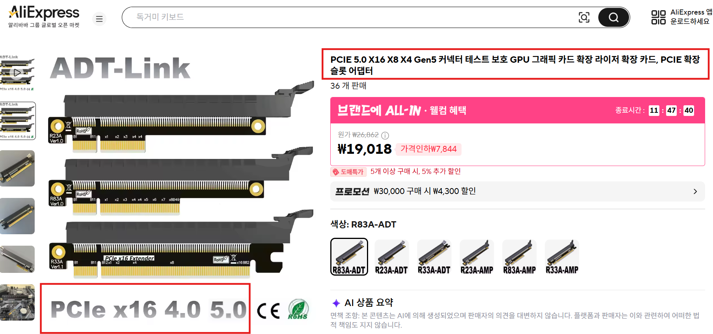
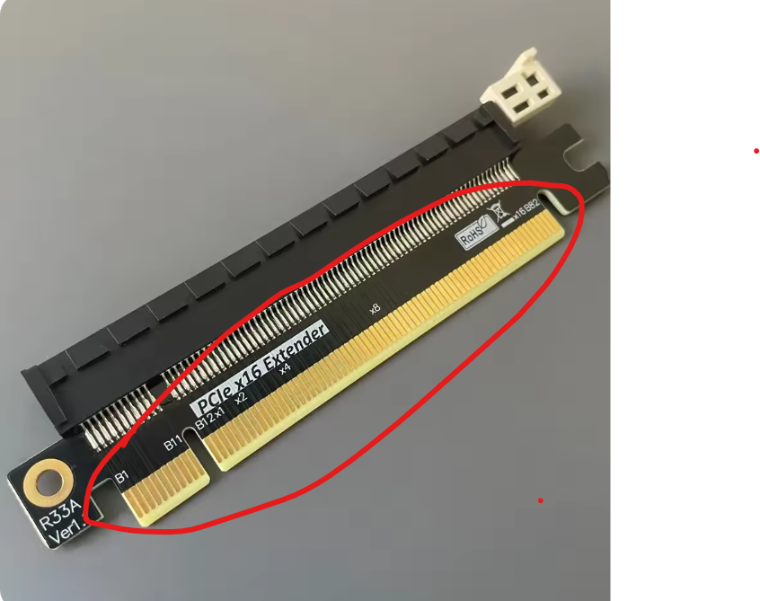

# 인트로
최근에 AI 인프라에 대한 공부를 하다고 있었습니다. 그러다보니 Kubernetes 기반에서 분산 학습/분산 추론, 물리적 장치들을 어떻게 가상화 하는지, 고속 통신이 어쩌구 하면서 어려운 내용의 기술들에 대해서 공부를 하고 있었습니다.

그렇게 고통받던 도중 SR-IOV라는 기술에 대해서 접했고 또 다시 기술의 이해를 위해서 고행의 길에 오르다 보니 어느순간 가상화의 기원에 대해서 공부하고 있었고? ― 여긴 어디 난 누구? ― 그 여정에서 공부한 내용들이 그냥 잊어버리기에는 너무 아깝다 생각이 들어 블로그에 정리하고자 합니다.

이 글은 우선 총 8개 정도의 장으로 구성할 예정이며 ― 바뀔수도 있다는거 그래도 한 길어져봐야 몇개 늘거나 줄어드는 정도일것 같습니다 ― 나름 긴 호흡으로 생각하면서 천천히 써내려갈 예정입니다.

# 여정의 시작
우선 여정의 시작을 하게된 ― 나를 자극한 ― 이 귀여운 SR-IOV 라는 놈부터 가볍게 톺아보고 다시 가상화 부분으로 딥 다이브 하여 bottom up 하겠습니다.

SR-IOV란 뭘까? 인터넷에 검색하면 다음과 같은 답변이 나옵니다.

## SR-IOV 살펴보기

> SR-IOV는 하나의 물리적 PCIe 하드웨어 장치를 여러 개의 가상 장치처럼 쪼개어 각 가상 머신(VM)에 직접 할당하는 인터페이스 가상화 기술입니다.

한마디로 하드웨어 장치는 하나지만 "PCIe 하드웨어 장치"라는 놈을 연결하는 인터페이스를 여러 VM이 나눠쓸 수 있도록 가상화 하는 기술 정도로 이해했습니다...

이렇게 그냥 이해하고 넘어갔으면 제가 1세대 가상화 기술부터 공부하지 않았었겠죠? 여기서 PCIe 라는게 뭐지? 하드웨어 장치인가? 하고 궁금해서 찾아보았습니다.

## PCIe 살펴보기
찾아보니 PCIe는 다음과 같다고 하네요.

> PCIe(PCI Express)는 메인보드와 그래픽카드, SSD 등의 부품을 연결하여 CPU와 초고속으로 통신하는 고속 데이터 전송 인터페이스 표준입니다.

여기서 알 수 있는건 그럼 PCIe는 메인보드 ↔ 하드웨어 부품 연결에서 고속 데이터 전송을 위한 인터페이스 표준이구나 라는걸 알 수 있고 위에서 SR-IOV 설명시 언급된 `물리적 PCIe 하드웨어 장치` 라는건 PCIe를 사용하는 하드웨어들을 의미하는 구나를 알 수 있었습니다 ― 추가적으로 그런 하드웨어들은 GPU, SSD, NIC, 사운드 카드, 캡처 카드(방송 송출 같은거 할때 쓰는), 확장 및 I/O 카드 같은게 있다고 하네요.

그럼 연결해서 설명을 다시 작성해보면 다음과 같이 이해할수도 있겠습니다.

> SR-IOV는 NIC, GPU, NVMe SSD(통칭 SSD)와 같은 PCIe를 하드웨어 장치를 여러 개의 가상 장치처럼 쪼개어 각 가상 머신에 직접 할당하는 인터페이스 가상화 기술입니다.

이렇게 보니 네트워크와 AI 인프라에서 왜 그렇게 SR-IOV가 계속 나왔는지 알겠네요.

그런데 좀 찾아보다 보니 PCIe도 세대, 규격이 조금 읽는 법이 있길래 좀 더 살펴보았습니다 ― 진짜 여기까지만 보고 더 안봐야지 라는 심정으로 살펴보았습니다.

### PCIe 읽는 법
PCIe를 찾아보면 아래와 같이 `PCIe x16 5.0` 이런식으로 PCIe라는 명칭 옆에 `x16`, `5.0`처럼 뭔가 부가적인 설명이 더 붙는 것을 확인할 수 있습니다.



결론부터 이야기 하자면 PCIe는 다음과 같은 형식으로 표기 된다고 합니다.
```plain text
PCIe Lane(차선) Gen(세대)
```

각각을 살펴보겠습니다.

#### PCIe의 Lane(차선)

가볍게 보면 **Lane**은 단자의 물리적 크기와 차선 수라고 합니다. 

여기서 단자라 함은 아래와 같은 노란색으로 된 메인보드의 슬롯에 꽂는 부분을 말합니다.

이러한 Lane은 `x1`, `x4`, `x16`과 같이 레인수가 표기되며, 레인 수가 많을수록 대역폭(전송 속도)이 커진다고 합니다.

각 하드웨어별로 일반적으로 사용하는 Lane을 보편적으로 아래와 같이 사용한다고 합니다 ― 일반적인 PC 기준이겠죠?
- **x1**: 랜카드, 무선 와이파이 카드 등
- **x4**: NVMe M.2 SSD 등
- **x16**: 고성능 그래픽카드(GPU) 전용

그리고 이러한 Lane도 다음과 같이 2가지 케이스로 구분된다고 하네요 
- CPU 레인: 프로세서에 직접 연결되어 지연 시간이 가장 짧고 속도가 빠르며 주로 그래픽카드나 메인 SSD에 할당
- 칩셋 레인: 메인보드 칩셋을 거쳐 CPU와 연결되는 통로.여러 장치가 대역폭을 나누어 쓰기 때문에 부품을 너무 많이 꽂으면 병목 현상 발생

#### PCIe의 Gen(세대)
세대를 나타내는 Gen은 데이터 전송 속도를 의미한다고 합니다. 
보통 PCIe 3.0, 4.0, 5.0 와 같이 표기되며 세대가 올라갈 때마다 속도가 정확하게 2배씩 빨라진다고 합니다.

여기서 "PCIe가 결국 인터페이스 라면 메인보드도 똑같은 세대를 지원해야할까?" 라는 의문이 들 수 있는데 당연히 메인보드도 지원하는 세대가 있다고 합니다 ― 그래도 PCIe 장비 ↔ 메인보드 세대가 꼭 맞지 않더라도 PCIe는 하위호환은 되기 때문에 속도는 낮아지더라도 동작은 한다고 하네요.


# 일단 여기까지

이 가상화 기술 탐구의 여정을 시작하게 된 계기인 SR-IOV만 가볍게 살펴보다 보니 PCIe 까지 이야기가 나왔네요;;;
― 제가 어쩌다가 가상화까지 공부하고 있었는지 알 수 있는 대목입니다 ^^.

우선 오늘은 제가 가상화 기술 탐구 여정을 시작하게 된 여정의 시발점을 간단하게 이야기 해드리고 그 SR-IOV, 그리고 PCIe 에 대해서 살펴보았습니다.

사실 다 잊고 SR-IOV는 물리장치 인터페이스 가상화(쪼개서) 해서 각 VM에 할당해줄 수 있는 기술이니 VM이랑 관련이 있겠구나!! 그래서 VM 여정 이야기에서 이런 이야기를 했구나!! 정도로만 짚고 넘어가면 될 듯 합니다.

어쩌다 이렇게 이렇게 이야기가 길어졌는지 저도 어지럽네요.
암튼 다음 장부터 가상화 기술의 발전사를 따라가며 현대 가상화가 어떤 기술들로 어떻게 구현되었는지 살펴보겠습니다.

Peace out.
