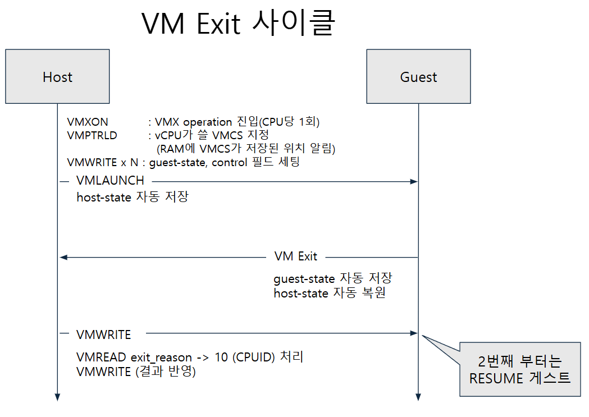
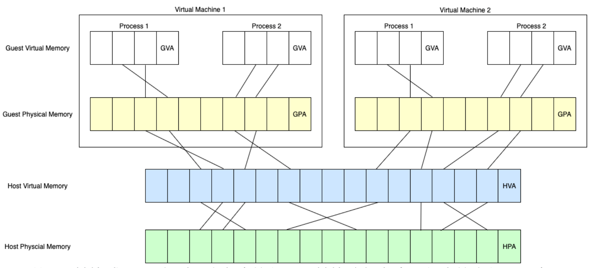

## 들어가며

지난 인트로 글에서는 제가 이 여정을 시작하게 된 계기인 SR-IOV를 가볍게 보다가 어쩌다 PCIe까지 흘러갔었죠;; ― 이젠 좀 삼천포로 빠지는 일은 없도록 자중해보겠습니다. ― 이번 글부터는 가상화 기술의 발전사를 따라가며 각 포인트들의 기술들을 가볍게 살펴보고자 합니다.

제가 "발전사"를 거를러 올라가게 된 계기는 다음과 같았습니다.

> SR-IOV? → PCIe 하드웨어 장비 가상화? → 가상화? → 왜 지금의 가상화? → ... → 가상화의 뼈대

이렇게 역순으로 파고들어가다 보니 가상화에 대한 주제를 이야기 하게 되었는데 막상 글을 적는건 제가 파고들어간 순서로 하면 이해가 잘 되지는 않더군요 ― 지난 글 [가상화 파헤치기](../가상화-파헤치기-인트로/)을 보고 스스로 많이 반성하고 있습니다. 그래서 이번에는 정석적으로 가상화의 뼈대가 되는 이론 "가상화는 자고로 이래야해!"를 정의한 유명한 논문의 내용부터 빠르고 가볍게 보며 이야기를 풀어나가고자 합니다.

##  1. 가상화의 뼈대가 되는 3대 원칙

가상화의 뼈대가 되는 3대 원칙은 1974년에 Gerald Popek과 Robert Goldberg ― 줄여서 포펙과 골드버그 라고 하겠습니다. ― 가 Formal Requirements for Virtualizable Third Generation Architectures라는 논문에서 처음 언급되었습니다.

해당 논문은 다음과 같은 VMM(a.k.a 하이퍼바이저)이 갖춰야 할 세 가지 속성을 정의했습니다.

| 속성                           | 내용                                                                                                        |
| ---------------------------- | --------------------------------------------------------------------------------------------------------- |
| **Equivalence  <br>**(동등성)   | VMM 위에서 도는 프로그램은 실제 하드웨어에서 돌 때랑 **본질적으로 똑같이** 동작해야 한다. (타이밍이랑 가용 자원량 차이는 예외로 봐준다는..?)                     |
| **Resource Control** (자원 제어) | VMM이 자원에 대한 **완전한 통제권**을 갖고 있어야 한다. 게스트가 VMM 몰래 자원을 슬쩍 가져갈 수 없어야 한다                                       |
| **Efficiency  <br>**(효율성)    | 명령어의 **통계적으로 대다수**가 VMM 개입 없이 하드웨어에서 바로 실행돼야 한다. ― 하이퍼바이저의 특권이 필요한 특수한 몇몇 케이스를 제외하고는 VM이 알아서 해야한다는 의미 정도? |
대강 살펴보면서 처음 두 개는 "당연한거 아닌가?"라는 생각을 하면서 넘어갔습니다. 그런데 세 번째 Efficiency의 설명을 보다보니 다음과 같은 궁금증이 생겼습니다.

### 1.1 그럼 "VMM이 개입해야 하는 명령어"가 있나보네?

Efficiency 내용을 보면 "대다수 명령어는 하드웨어에서 그냥 돌아야 한다"는 건데, 이를 반대로 생각해보면 **"그냥 돌면 안 되는 소수의 명령어가 있다."** 잖아요? 그래야 "이 명령들만 VMM이 개입하고 나머지는 VM이 알아서 하게 둔다"는 말이 성립하니까요.

그래서 이 논문은 명령어를 다음 3가지 케이스로 나눕니다.

* Privileged (특권) : 유저 모드에서 실행하면 트랩이 걸리며, 슈퍼바이저 모드에서는 정상적으로 실행되는 명령어들
* Sensitive (민감) : 민감 명령어들은 또 2가지 케이스로 세분화 됩니다.
	* Control-sensitive : 시스템 자원 구성을 바꾸려는 명령어들(메모리 매핑 변경, 특권 모드 변경 등...)
	* Behavior-sensitive : 실행 결과가 현재 시스템 구성에 따라서 달라지는 명령어들(현재 어떤 모드인지, 어느 주소에 있는지에 따라 다른 값을 반환)
* Innocuous (무해) : 특권과 민감에 해당하지 않는 말 그대로 VM이 알아서 해도 큰 문제 없는 명령어들.

이렇게 명령어들이 나뉘며 특권과 민감은 함부로 VM이 실행하면 안되는 예민한 명령어들입니다.
설명을 보다가 저는 여기서 문득 아래와 같은 의문이 생기더군요

>민감 명령어도 VM이 함부로 실행하면 안되는데 왜 특권 명령어랑 분리해서 정의했지?

이 질문에 대한 답은 의외로 금방 나왔습니다. 민감 명령어는 가상화 환경에서 사실상 특권 명령어처럼 트랩이 걸려서 VMM이 대신 실행해야 하지만 그렇지 못한 케이스를 나타내기 위해서 분리했다고 합니다.

여기서 한 가지 다음과 같은 의문이 또 들었습니다.

> 그럼 왜 그런 엣지 케이스가 생겼지?

이 질문의 답은 그저 가상화 발전 과도기에 기존의 CPU 설계가 `OS ↔ 일반 앱` 구조만 고려했고 가상화는 `VMM ↔ Guest OS ↔ 일반 앱`구조인 구조 차이로 인해서 엣지 케이스가 발견되었다고 합니다.

이러한 상황을 고려해서 이 논문에서 Trap-and-Emulate 방식의 고전적인 하드웨어 가상화가 성립하기 위해서 다음과 같은 공식이 성립해야 한다고 주장합니다.

### 1.2 민감 명령어는 특권 명령어에 포함되어야 한다.

그 공식은 바로 아래의 공식입니다.

$$\text{Sensitive Instructions} \subseteq \text{Privileged Instructions}$$

이는 "Sensitive 명령어의 집합이 Privileged 명령어 집합의 부분집합이면, 그 아키텍처 위에 VMM을 만들 수 있다." 를 의미합니다.

> 좀 더 라이트하게 설명하면 "위험한 짓을 하는 명령어들이 죄다 트랩(Trap)만 걸어준다면, VMM 입장에서는 그 트랩을 잡아서 대신 해줘 VM 본인이 직접 한 것처럼 흉내(Emulate)내주면 끝"이라는 이야기 입니다.

*이래서 Trap and Emulate 입니다.*

이외에도 재귀적 가상화 ― 하이퍼바이저 위에 하이퍼바이저 올리기, 하이브리드 VMM 의 조건 관련된 정리 2,3 도 있는데 이것들 까지 살펴보면 글이 너무 길어지니 일단 넘어가고 정리하자면...

좀 멀리 돌아왔는데 결국 포펙과 골드버그는 "이상적으로는 민감 명령어가 전부 특권 명령어여야 가상화가 가능한데, 현실의 CPU들은 그렇지 않은 엣지 케이스들이 존재한다"는 사실을 증명하고 지적하기 위해서 두 개념을 분리해서 정의했다는 겁니다.

> 자아 : 여기서 또 아까 말한 구조 차이로 인해서 엣지 케이스가 발견된 아키텍처가 뭔지, 그 민감 명령어가 뭔지 궁금해.... 
> 
> 이성 : 적당히 해 소코마데다

원래는 제가 커널 레벨의 명령어들을 잘 모르더라도 호기심에 좀 더 찾아서 정리를 열심히 하고 있었는데 이성이 휴가에서 돌아와서 솔직히 여기까지는 좀;; 이라는 생각에 폭주를 멈추었습니다.

혹시 궁금하면 아래를...

## 2. 여러 회사들의 노오력 (a.k.a. 똥꼬쇼)

이 전에 언급했듯 가상화 초기에는 CPU 설계 자체가 가상화를 고려하지 않던 구조로 나왔었습니다. 하지만 CPU가 안 도와준다고 가상화를 포기할 수는 없으니, 사람들은 각자의 방식으로 이 문제를 우회하기 시작했습니다.

그들의 노오력은 아래 표로 크게 2가지가 나왔으며, 우린 이것을 "1세대 가상화" 라고 부르기로 약속 했어요

|        | ① Binary Translation (전가상화)                                                              | ② Paravirtualization (반가상화)                                       |
| ------ | ---------------------------------------------------------------------------------------- | ----------------------------------------------------------------- |
| 대표     | VMware (1998)                                                                            | Xen (2003)                                                        |
| 핵심     | **트랩이 안 걸리면 실행 전에 코드를 바꿔치기**하자                                                           | **게스트한테 가상화된 상태임을 알려**주고 협조를 구하자                                  |
| 방법     | - 게스트 커널 코드를 basic block 단위로 런타임 번역<br>- 무해한 명령은 거의 1:1 복사<br>- 민감한 명령만 VMM 호출로 치환결과는 캐시 | 게스트 커널 소스에서 민감한 명령어 시퀀스를 hypercall로 교체<br>→ 트랩이 필요 없음(게스트가 직접 호출) |
| 게스트 수정 | 불필요                                                                                      | 필수 (커널 포팅)                                                        |
| 대가     | 번역기 자체의 복잡도, code cache 압박, 자기수정 코드 등 난제                                                 | Windows처럼 소스 수정이 불가한 OS는 불가, 하이퍼바이저 종속                            |

위 두 가상화 방식을 그림으로 표현하자면 아래와 같습니다.

|               1세대 가상화 : 전 가상화               |                1세대 가상화 : 반 가상화                |
| :-----------------------------------------: | :-------------------------------------------: |
|  | <br> |

이러한 1세대 가상화 기술의 BT(Binary Translation)은 사실 현대에 오면서 VT-x 와 AMD-V 같은 하드웨어 지원 가상화 기술이 거의 대체해서 도태되었으며, 반 가상화 같은 경우 I/O 디바이스 드라이버 계층만 PV 드라이버(VirtIO) 형태로 모듈 형태로 구현되어 Guest OS 커널에 올라가 사용되고 있는 추세입니다.

> 사실 여기서 왜 I/O 디바이스 드라이버 계층만 PV 드라이버를 사용하여 구현했는지 그리고 VirtIO 없이 하는 I/O와 VirtIO가 있을 때의 방식이 어떤 차이가 있는지... 궁금해서 더 찾아보았는데 해당 내용은 Too much 임지만 그래도 공부한 김에 아래 내용을 남겨봅니다.
> 
> P.S Gemini에게 제가 작성한 내용을 기반으로 Markdown `<details>` 방식으로 작성해달라고 하니 내용을 좀 많이 만졌네요 ㅠ... 그래도 핵심은 변하지 않았으니 참고하면 될 것 같습니다.

<details>
<summary><strong>VirtIO의 동작 원리와 QEMU의 역할 (I/O 처리 흐름 비교)</strong></summary>

<br/>

<h4>1. VirtIO의 동작 방식 (반가상화)</h4>
<p>
  게스트 OS의 커널 코어를 직접 수정하지는 않지만, 가상화 전용 디바이스 드라이버(<code>virtio_net</code>, <code>virtio_blk</code>)를 커널 모듈로 로드합니다.
</p>
<ul>
  <li><strong>가상화 인지:</strong> 드라이버가 가상 머신 환경임을 인지하고 실제 물리 칩셋 레지스터를 에뮬레이션하는 과정을 건너뜁니다.</li>
  <li><strong>공유 메모리 활용:</strong> 하이퍼바이저와 사전에 약속된 공유 메모리 구조(<code>vring</code>, <code>virtqueue</code>)에 전송할 데이터를 직접 배치합니다.</li>
  <li><strong>Kick 신호:</strong> 데이터가 준비되면 하이퍼바이저에 Kick 신호를 전송하여 알림을 전달합니다.</li>
</ul>

<hr/>

<h4>2. VirtIO 환경에서 QEMU가 필요한 이유</h4>
<p>
  VirtIO 드라이버가 I/O를 직접 처리하는 것처럼 보여도, 아래와 같은 핵심 계층에서 QEMU의 역할이 요구됩니다.
</p>
<ul>
  <li><strong>초기 부팅 및 펌웨어 지원:</strong> 게스트 OS 부팅 초기(커널 로드 전)에는 VirtIO 드라이버가 동작하지 않으므로, BIOS/부트로더가 인식할 기본 하드웨어 에뮬레이션을 QEMU가 담당합니다.</li>
  <li><strong>가상 버스/장치 노출:</strong> VirtIO 장치가 게스트에 인식되려면 "가상 PCI 슬롯에 연결된 디바이스" 형태로 보여야 하므로, PCI 버스 및 PnP(Plug & Play) 계층을 에뮬레이션합니다.</li>
  <li><strong>VirtIO 백엔드(Backend) I/O 처리:</strong> 게스트가 Virtqueue에 버퍼를 올리고 Kick을 보내면, 유저스페이스의 QEMU가 이를 읽어 호스트의 실제 파일/블록 디바이스 시스템 콜로 기록합니다.</li>
  <li><strong>이기종 아키텍처 지원:</strong> TCG(Tiny Code Generator)를 통해 x86 호스트에서 ARM64, RISC-V 등의 다른 아키텍처 에뮬레이션을 제공합니다.</li>
  <li><strong>레거시 환경 호환:</strong> VirtIO 드라이버를 지원하지 않는 레거시 OS 구동 시 완전 하드웨어 에뮬레이션 모드로 동작합니다.</li>
</ul>

<hr/>

<h4>3. I/O 처리 흐름 비교</h4>

<p><strong>[1] VirtIO 부재 시: 순수 에뮬레이션 I/O</strong></p>
<pre><code>[Guest Space]
1. 게스트 앱 (write 요청)
2. 게스트 커널 (표준 IDE/SATA 드라이버)
3. I/O 포트/레지스터 쓰기 명령 (outb / MMIO)
   └─▶ CPU가 이를 가로채며 즉각 VM-Exit 발생!
─────────────────────────────────────────────
[Host Kernel (KVM)]
4. KVM 모듈: "하드웨어 포트 접근 이벤트 감지" -> 커널에서 처리 불가
5. ioctl(KVM_RUN) 반환 -> 유저스페이스 QEMU 깨움 (Heavy Context Switch)
─────────────────────────────────────────────
[Host User Space (QEMU)]
6. QEMU: "게스트가 IDE 포트 0x1F0에 1바이트 썼구나" 하며 칩셋 로직 에뮬레이션
   (※ 패킷/블록 전송 시 3~6번 과정이 수십~수백 번 반복됨)
7. QEMU가 호스트 커널 시스템 콜(write, aio_write 등) 호출</code></pre>

<p><strong>[2] VirtIO 적용 시: 반가상화 I/O</strong></p>
<pre><code>[Guest Space]
1. 게스트 앱 (write 요청)
2. 게스트 커널 (virtio_blk / virtio_net 드라이버)
3. 공유 메모리(Virtqueue)에 버퍼 디스크립터들을 일괄 배치(Batching)
4. Kick 신호 전송 (I/O 포트 단 1회 쓰기 또는 Hypercall)
   └─▶ 단 1번의 VM-Exit 발생!
─────────────────────────────────────────────
[Host Kernel (KVM)]
5. KVM 모듈: Kick 신호(Eventfd / irqfd) 수신 후 QEMU 워커 스레드 깨움
─────────────────────────────────────────────
[Host User Space (QEMU)]
6. QEMU (VirtIO Backend): 공유 메모리(Virtqueue)에서 쌓인 버퍼들을 한 번에 Pop
7. 호스트 커널 시스템 콜(writev, libaio, io_uring 등)로 파일/디스크에 즉시 기록</code></pre>

<hr/>

<h4>4. 최근 관련 기술 동향</h4>
<p>
  QEMU 유저스페이스 진입에 따른 컨텍스트 스위칭 오버헤드를 더욱 줄이기 위해 다음과 같은 기술들이 발전하고 있습니다.
</p>
<ul>
  <li><strong>vhost-net / vhost-user:</strong> 데이터 플레인(I/O 처리)을 호스트 커널 또는 별도 전용 유저 프로세스로 직접 연결하여 QEMU를 우회.</li>
  <li><strong>경량 가상화(MicroVM):</strong> 레거시 디바이스 에뮬레이션을 완전히 걷어내고 VirtIO 전용으로 최소화한 하이퍼바이저(AWS Firecracker, Cloud Hypervisor).</li>
</ul>

</details>

|        | ③ Hardware-assisted (현대 가상화)                                   |
| ------ | -------------------------------------------------------------- |
| 대표     | Intel VT-x (2005) / AMD-V (2006)                               |
| 아이디어   | CPU를 고쳐서 트랩이 걸리게 만들자                                           |
| 방법     | 기존 Ring과 직교하는 새 차원(root/non-root)을 추가 · 게스트 커널이 진짜 Ring 0에서 돈다 |
| 게스트 수정 | 불필요                                                            |
| 대가     | VM Exit 비용, 초기엔 shadow paging 여전히 필요                           |

|            2세대 가상화 : Hardware-assisted            |
| :-----------------------------------------------: |
|  |

이게 많이 알려져있는 형태의 2세대 하드웨어 지원 가상화의 그림입니다. 사실 요즘은 2세대 가상화 기술 말고는 잘 안쓰이니까 이 부분만 알아도 될 것 같긴합니다.

여기서 하이퍼바이저 부분에 Ring-1 이라고 되어있는데 이게 사실 Ring-1이라는 계층은 존재하지 않지만 개념적으로 이해하기 쉽게 만들기 위해서 저렇게 설명하는 경우가 꽤 많다고 하더군요.

실제로 이렇지는 않다.. 라고 하니까 그냥 넘어가기가 조금 찝찝하더라구요. 그래서 다음 부분에서 이 부분에 대해서 조금 더 공부한 내용을 정리하며 제가 나름대로 이해한대로 만든 이미지를 통해서 조금 더 정확한 그림으로 표현했습니다.

## 3. CPU를 고쳐버린 결과물, VT-x
### 3.1 Ring 외의 추가적인 계층 형성

바로 전에 Ring-1 이라는 표현을 이미지에서 사용하고 보충 설명에 Ring-1은 개념적 표현이고 실제하지는 않는다 라고 설명했습니다. 많은 설명 글들이 이 표현을 사용해서 저도 처음에 Ring 0보다 더 권한이 높은? 링이 하나 생긴 거구나 하고 오해했지만 실제로는 아니었습니다.

우선 Ring이라는 표현에 대해서 간단하게 짚고 넘어가고자 합니다.

> x86의 **Ring**은 `CPL`(Current Privilege Level)이라는 **2비트** 필드입니다. 0~3만 표현할 수 있고, -1을 넣을 인코딩 자체가 존재하지 않다고 합니다. Intel 에서도 "Ring -1"이라는 표현은 공식적으로 사용하지 않는다 하며, 대신 **VMX root operation / VMX non-root operation**이라는 공식적인 표현이 있습니다.
> 
> 즉 "더 권한이 높은 링"이 아니라 **다른 모드를 하나 더 사용하는** 것입니다. 그래서 root와 non-root 각각에도 Ring 0~3이 다 존재합니다.

.png)

제가 이해한 2세대 가상화의 모습은 대강 이러했습니다. 이러한 root, non-root 구조의 분리는 다음과 같은 이점이 있습니다.
* Guest OS가 Ring0를 사용한다. 이전 1세대에선 Guest OS가 Ring1에 존재하여 커널 명령 처리에서 BT나 Hypercall같은 기술을 사용했지만 이제는 그런 커널의 변형이나 BT 같은 보조역할을 하는 것들이 필요 없어졌습니다.
* 뭘 VM Exit시킬지는 VMCS의 control 필드로 세밀하게 정한다. 그러니까 "트랩할지 말지"가 하드웨어에 고정된 값이 아니라 하이퍼바이저 마음대로 정하는 정책이 된 거다 → 여기서 성능 튜닝의 여지가 생깁니다.

여기서 갑자기 VMCS라는게 등장했는데 사실 이게 VT-x 에서 핵심적인 역할을 하기에 다음에 이어서 설명하겠습니다.

그전에 완벽하게 다 이해하지는 않았지만 조사하다 나온 VMX 명령어들에 대한 정리를 그냥 버리기에는 아까워 우선 참고용으로 남기고자 합니다.

### 3.2 VMX 명령어
| 명령어                               | 역할                                                                   |
| --------------------------------- | -------------------------------------------------------------------- |
| `VMXON` / `VMXOFF`                | VMX operation 진입/이탈. VMXON 영역(4KB)이 필요합니다. KVM 모듈 로드 시 각 CPU에서 실행됩니다 |
| `VMPTRLD` / `VMPTRST` / `VMCLEAR` | 현재 CPU가 사용할 VMCS 포인터 지정 · 저장 · 초기화                                   |
| `VMREAD` / `VMWRITE`              | VMCS 필드 읽기/쓰기. **일반 메모리 접근으로는 못 건드립니다**                              |
| `VMLAUNCH`                        | 해당 VMCS의 **첫 번째** VM Entry. launch state가 clear여야 합니다                |
| `VMRESUME`                        | 두 번째 이후의 VM Entry. 일부 정합성 검사를 생략하므로 **VMLAUNCH보다 빠릅니다**              |
| `VMCALL`                          | 게스트 → 하이퍼바이저 명시적 호출(hypercall). 무조건 VM Exit                          |
| `INVEPT` / `INVVPID`              | EPT/VPID 관련 TLB 엔트리 무효화                                              |

### 3.3 VMCS : 게스트 CPU가 들어있는 4KB 메모리 구조체

한 문장으로 정리하면 VT-x에서 VM과 호스트 사이의 상태 전환과 동작을 제어하는 4KB짜리 메모리 구조체입니다.

vCPU 하나당 하나씩 있으며, 게스트의 CPU 상태 전부와 트랩관련 정책이 여기에 다 들어있습니다. 대강 논리적인 구조로 보면 아래와 같은 6개의 영역으로 나뉩니다.

| 영역                         | 내용                                                                                                                        | 사용 시점                                     |
| -------------------------- | ------------------------------------------------------------------------------------------------------------------------- | ----------------------------------------- |
| **① Guest-state area**     | CR0/CR3/CR4, RSP, RIP, RFLAGS, 세그먼트 레지스터 전체, GDTR/IDTR/LDTR/TR, `IA32_EFER` 등 MSR, activity state, interruptibility state | VM Exit 시 **자동 저장**, VM Entry 시 **자동 복원** |
| **② Host-state area**      | 호스트의 CR0/CR3/CR4, RSP, **RIP**(= VM Exit 후 하이퍼바이저가 재개할 지점), 세그먼트 셀렉터                                                      | VM Exit 시 **자동 로드**                       |
| **③ VM-execution control** | **무엇을 VM Exit시킬지 결정하는 정책.** pin-based / processor-based control, exception bitmap, I/O bitmap, MSR bitmap, EPTP, VPID     | **여기가 성능 튜닝의 핵심**                         |
| **④ VM-exit control**      | host address-space size, VM Exit 시 저장/로드할 MSR 목록 등                                                                        | VM Exit 동작 방식 제어                          |
| **⑤ VM-entry control**     | IA-32e mode guest 여부, **VM-entry interruption-information field** ― 하이퍼바이저가 게스트에게 인터럽트/예외를 **주입**하는 통로                    | 인터럽트 주입 시                                 |
| **⑥ VM-exit information**  | 읽기 전용. **exit reason**, exit qualification, guest-linear/physical address, 명령어 길이 등                                       | VM Exit 후 "왜 나왔는지" 파악                     |

보기만 해도 어지럽네요... 표만 보면 "아 하드웨어가 알아서 다 해주는구나" 싶지만서도, 궁금해서 몇 가지 찾아보다가 나온 내용이 있어 추가적으로 남깁니다.

**1. 범용 레지스터(RAX, RBX, RCX…)는 VMCS에 없습니다.** RSP와 RIP만 들어있고, 나머지 GPR은 **하이퍼바이저가 소프트웨어로 직접 저장하고 복원**해야 합니다. KVM 안에 손으로 쓴 어셈블리가 있는 이유가 이겁니다(`arch/x86/kvm/vmx/vmenter.S`). VM Exit 직후 게스트의 RAX가 어디 있냐고 물으면, 답은 "KVM 스택에 쪽에서 찾을 수 있다"입니다.

<details>
<summary>"소프트웨어로 직접 저장하고 복원한다"의 의미</summary>

`arch/x86/kvm/vmx/vmenter.S`는 소스 코드 파일입니다. 즉 "GPR을 저장/복원하는 어셈블리 명령어가 텍스트로 적혀 있는 파일"이지, 실행 시점에 레지스터 값이 이 파일 안으로 들어가는 게 아닙니다 ― 저는 처음에 진짜 파일에 저장하는 줄 알았습니다.

1. 커널 빌드 시 `vmenter.S`가 어셈블되어 KVM 커널 모듈 바이너리의 일부(기계어)로 포함됩니다
2. vCPU가 게스트로 진입하기 직전, 이 코드가 실행되면서 게스트의 GPR 값을 물리 CPU 레지스터에 로드합니다
3. `VMLAUNCH`/`VMRESUME` 실행 → 게스트 모드로 전환 (RIP/RSP는 VMCS에서 하드웨어가 자동 로드, 나머지 GPR은 방금 로드해둔 값 그대로)
4. VM Exit 발생 → 하드웨어가 RIP/RSP 등은 Host-state area 값으로 되돌려줍니다. 하지만 이 순간 물리 레지스터에는 여전히 게스트가 쓰던 값이 남아 있습니다. 하드웨어는 이걸 어디에도 저장해주지 않습니다
5. 그래서 호스트로 복귀한 직후 `vmenter.S`의 코드가 가장 먼저 이 값들을 vCPU 구조체(`vcpu_vmx`) 안의 배열로 복사합니다

</details>


**2. VMCS의 실제 메모리 레이아웃은 공개돼 있지 않습니다.** 구현마다 다르고 무조건 `VMREAD`/`VMWRITE`로만 접근해야 하는데, 이 명령어들이 일반 `MOV`보다 훨씬 느립니다. 그래서 KVM은 자주 쓰는 VMCS 필드를 **소프트웨어 캐시**로 따로 들고 다닙니다. AMD의 VMCB는 이런 제약이 아예 없다고 합니다.

### 3.4 VM Exit 비용

VMCS의 **③ VM-execution control**가 어떤걸 VM Exit 시킬지 정하는 정책이고 이곳이 성능 튜닝의 핵심 포인트라고 설명드렸습니다. 성능 튜닝의 핵심이라함은 곧 비용이 많이 드는 구간이라는 의미인데, 이게 실제로 비용이 어느정도 드는지 확인하기 위해서 VM Exit의 사이클이 어떻게 되는지 공부해 그림으로 나타내 보았습니다.



자게한 작동은 다음 장에서 알아보는거로 하고 뭐 결론만 보면 Host와 Guest 사이에서 왔다 갔다 하는 동작이라 간단하게 말하면 컨텍스트 스위치의 오버헤드가 있습니다.

다행이 첫 사이클보다 다음 사이클에는 VMRESUME으로 진행되며 이 과정은 일부 정합성 검사를 생략하므로 **VMLAUNCH** 보다 빠르다고 합니다.

추가적으로 VM Exit의 비용이 대강 어느 정도로 비싼지 보기 위해 아래 비교 표를 통해 확인할 수 있습니다.

| 구간                                        | 대략적 비용                |
| ----------------------------------------- | --------------------- |
| 일반 함수 호출                                  | 수 사이클                 |
| 시스템 콜 (`syscall`)                         | ~100 사이클대             |
| **VM Exit → VM Entry 왕복 (하드웨어 전환만)**      | **수백 ~ 1,000 사이클대**   |
| **VM Exit + KVM 커널 내 처리 (fast path)**     | **1,000 ~ 수천 사이클**    |
| **VM Exit + 유저스페이스(QEMU) 왕복 (slow path)** | **수만 사이클**, 자릿수가 다릅니다 |
위 표의 수치는 대략적인 비용이고 정확한 수치는 CPU 별로 달라 직접 측정을 해야합니다. 직접 확인을 하고 싶으면 아래와 같은 방법으로 가능합니다.

* [kvm-unit-tests](https://gitlab.com/kvm-unit-tests/kvm-unit-tests)사용 : vmexit 벤치마크도구로 VM Exit 종류별 사이클을 재는 표준 도구 
* `perf kvm stat live` 명령 : 현재 도는 VM의 exit reason별 횟수와 소요 시간을 실시간으로 보여줌
* `trace-cmd record -e kvm` 명령 : kvm_exit 과 kvm_entry 추적

참고로 exit reason은 16비트의 필드고 보통 아래 정도가 자주 보는 값이라고 합니다.
(전체 목록은 인터넷 찾아보면 나오지 않을까 싶습니다. 아니면 Intel SDM쪽 보면 나옵니다.)

| 번호           | 이름                                       | 언제                                                 |
| ------------ | ---------------------------------------- | -------------------------------------------------- |
| 0 / 1        | Exception or NMI / External interrupt    | exception bitmap에 걸린 예외, 또는 호스트로 향하는 외부 인터럽트       |
| 10           | CPUID                                    | **무조건 exit.** 벤치마크에서 VM Exit 비용 측정용으로 애용됩니다        |
| 12           | HLT                                      | 게스트가 idle 진입. KVM이 vCPU 스레드를 재웁니다                  |
| 18           | VMCALL                                   | 게스트의 명시적 hypercall                                 |
| 28           | Control-register access                  | CR0/CR3/CR4 조작 (EPT를 켜면 CR3 exit은 대부분 사라집니다)       |
| 30 / 31 / 32 | I/O instruction, RDMSR, WRMSR            | bitmap에 걸린 포트/MSR 접근                               |
| 48 / 49      | **EPT violation** / EPT misconfiguration | 매핑 없음·권한 위반(복구 가능) / EPT 엔트리 자체가 잘못됨(보통 하이퍼바이저 버그) |

여기까지 살펴본 가상화는 주로 CPU 관련 내용이었습니다. 가상화에서 Ring도 나누고 Root mode도 나누고 하다보니 메모리 또한 새로운 구조를 고려해야 했으며 그 고려 사항들을 아래에 가볍게 정리해보고자 합니다. 

---

## 4. 가상화 환경에서의 메모리 구조

> 이 블로그에 가상환경의 메모리 관련 이야기가 정말 잘 설명되어 있으며 저도 이 내용을 참고하여 작성하였습니다 :)
> https://www.alibabacloud.com/blog/599058

우선 가상화 환경에서의 메모리는 다음과 같은 구조를 갖습니다.


이러한 가상화 환경의 메모리 구조는 실제 호스트 물리 영역에 도달하기까지 아래와 같은 경로로 변환되어야 합니다.

```text
GVA (Guest Virtual)  --게스트 페이지 테이블-->  GPA (Guest Physical)
GPA (Guest Physical) --하이퍼바이저가 관리 -->  HPA (Host Physical)
```

여기서 중요한 점은 가상 주소 -> 물리 주소의 변환은 MMU(Memory Management Unit)이라는 CPU 코어 내의 하드웨어가 담당하고 MMU는 저런 가상 환경 처럼 여러 단계 변환을 하도록 만들어진게 아니라 사실 1단 변환만 가능합니다.

이러한 능력이 부족한? MMU를 위해서 "MMU 형은 계산만해!" 를 선언하고 다른 여러 기술들을 통해서 MMU 형을 물심양면으로 도와오고 있습니다.

아래에서는 그 기술들의 세대별 등장 ― 뭐 전체는 아니고 좀 핵심적인 기술들만 ― 을 정리했습니다.
### 1세대 : SPT (섀도 페이지 테이블)

하이퍼바이저가 GVA → HPA를 바로 매핑 하기 위해 GVA → GPA를 읽고 GPA → HPA 매핑 정보를 합쳐서 GVA->HPA 엔트리를 가진 별도의 페이지 테이블인 SPT를 만드는 기술입니다.

이렇게 만들어진 SPT를 CPU 레지스터인 CR3가 가르키게(SPT 시작 주소를 넣음) 만들어 
GVA → HPA 매핑을 시킵니다.

<details>
<summary>CR3란?</summary>

CPU 코어당 하나 존재하는 레지스터로 가상 메모리를 물리 메모리로 변환할 때 사용하는 최상위 페이지 테이블의 물리 주소를 담고 있습니다.
</details>

특징은 대강 다음과 같습니다.
* 가상 메모리는 프로세스 마다 존재하니 게스트 프로세스 마다 SPT가 별도로 존재합니다.
* 게스트 페이지 테이블에는 쓰기 금지를 걸어 게스트는 페이지 테이블을 건드리지 못합니다. 

하지만 이러한 특징들 때문에 아래와 같은 단점들을 가집니다.
* 게스트가 자기 페이지 테이블에 쓰기 금지가 걸려있다 보니 페이지 테이블 변경이 필요할때 마다 VMM의 개입이 필요해 VM Exit가 빈번하게 일어납니다.
*  SPT가 프로세스별로 필요해 메모리를 많이 차지합니다.
* 프로세스 별 SPT 보유로 인해 게스트의 프로세스가 바뀌면 다른 SPT를 가리켜야 하고 기존에 캐시된 TLB 엔트리가 유효하지 않아 TLB 플러시가 일어납니다.

이러니 1세대 기술이라 불리며 결국 도태되는 기술이 되고 새로운 방법인 2세대 방식이 등장하게 됩니다.

### 2세대 : EPT / NPT (현재 기본값)

하드웨어가 2단 변환을 직접 하게 됐습니다. 게스트 페이지 테이블(GVA→GPA)은 게스트가, EPT(GPA→HPA)는 하이퍼바이저가 각각 독립적으로 관리합니다.

이러한 구조 덕분에 장점을 얻었지만 여전히 단점은 존재했습니다.

장점으로는 게스트가 페이지 테이블을 마음대로 고쳐도 페이지가 따로 관리되니 VMM 개입이 필요 없게 되었습니다.
하지만 이렇게 얻은 장점 뒤에는 단점 또한 존재합니다. TLB miss 시 조회가 최대 24번 정도 난다는 겁니다. 왜 최대 24번인지? 제가 처음에 의문이 들었기에 그 내용을 간단하게 짚고 넘어가겠습니다. 

<details>
<summary>일반적인 메모리 테이블 조회 4단계</summary>

표준 메모리 테이블은 x86-64 기준으로 4단계로 구성되며 아래와 같습니다.

가상주소 → PML4 → PDPT → PD → PT → 물리 프레임 

가상 주소는 48비트로 9비트씩 4블록 총 36비트가 각 단계의 인덱스로 쓰이고 마지막 12비트는 물리 프레임안에서 오프셋으로 쓰입니다.
</details>

#### TLB miss 시 조회가 최대 24번인 이유


> 사실상 여기서 SPT는 도태되었습니다.
> 
> 이후에 뭐 SPT, EPT 섞어쓰는 하이브리드도 나오고 별애별게 나왔지만 결국 지금은 다 잘 사용하지 않는다고 합니다.
> 
> 다만, 하드웨어 지원이 없거나 **중첩 가상화**(VM 안의 VM)일 때 shadow EPT 형태로 여전히 동작한다고 합니다.

### 3세대 : Huge page 및 양방향 정렬

24번을 4번으로 줄이려는 시도들은 대부분 실패했고, 방향이 바뀌어 **변환을 빠르게** 하는 대신 **변환 자체를 안 하게** 만들게 설계 하였습니다. 

1. **Huge page** (실무의 핵심). 페이지를 2MB/1GB로 키우면 TLB 한 칸이 커버하는 범위가 넓어져 miss 자체가 줄고, miss가 나도 워크 단계가 짧아집니다.
2. **양쪽 정렬**. 게스트가 huge page를 써도 호스트가 4KB로 뒷받침하면 효과가 반감됩니다. 게스트 huge page가 호스트 huge page로 뒷받침되는 정렬이 필요합니다 — QEMU/KVM에서 hugetlbfs 백킹을 쓰는 이유.
3. **하드웨어 보강**. TLB 용량 확대, page walk cache, 연속된 매핑을 TLB 한 칸으로 병합하는 기법.


개인적으로 이 장을 정리하면서 제일 크게 기억나는건 "CPU 가상화 / 메모리 가상화 / I-O 가상화는 각각 별개의 문제다" 라는 겁니다. 처음엔 그냥 가상화 뭐 솔루션 하나로 되는거 아닌가? 라는 생각이었는데 실제로는 많은 난관들이 있었고 이러한 난관들을 해결하기 위한 다양한 해결책들이 있었다. 라는 것을 알 수 있었습니다.

