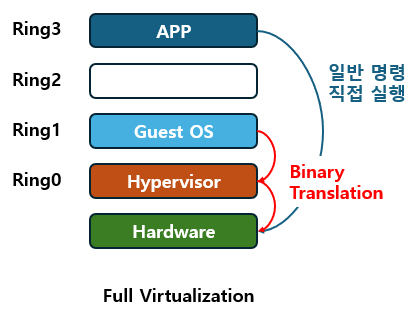
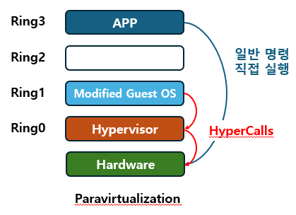
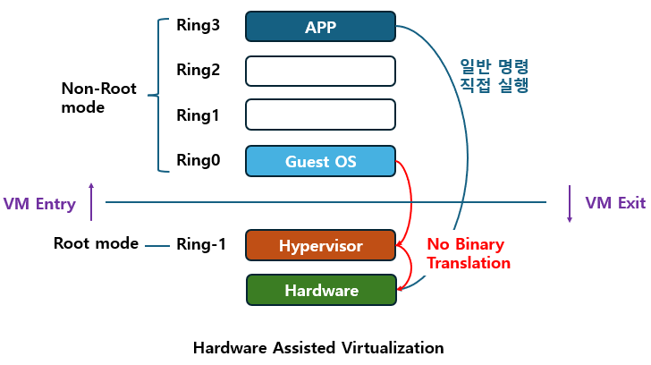

## 들어가며

지난 인트로 글에서는 제가 이 여정을 시작하게 된 계기인 SR-IOV를 가볍게 보다가 어쩌다 PCIe까지 흘러갔었죠;; ― 이젠 좀 삼천포로 빠지는 일은 없도록 자중해보겠습니다. ― 이번 글부터는 가상화 기술의 발전사를 따라가며 각 포인트들의 기술들을 가볍게 살펴보고자 합니다.

제가 "발전사"를 거를러 올라가게 된 계기는 다음과 같았습니다.

> SR-IOV? → PCIe 하드웨어 장비 가상화? → 가상화? → 왜 지금의 가상화? → ... → 가상화의 뼈대

이렇게 역순으로 파고들어가다 보니 가상화에 대한 주제를 이야기 하게 되었는데 막상 글을 적는건 제가 파고들어간 순서로 하면 이해가 잘 되지는 않더군요 ― 지난 글 [가상화 파헤치기](../가상화-파헤치기-인트로/)을 보고 스스로 많이 반성하고 있습니다. 그래서 이번에는 정석적으로 가상화의 뼈대가 되는 이론 "가상화는 자고로 이래야해!"를 정의한 유명한 논문의 내용부터 빠르고 가볍게 보며 이야기를 풀어나가고자 합니다.

##  1. 가상화의 뼈대가 되는 3대 원칙

가상화의 뼈대가 되는 3대 원칙은 1974년에 Gerald Popek과 Robert Goldberg ― 줄여서 포펙과 골드버그 라고 하겠습니다. ― 가 Formal Requirements for Virtualizable Third Generation Architectures라는 논문에서 처음 언급되었습니다.

해당 논문은 다음과 같은 VMM(a.k.a 하이퍼바이저)이 갖춰야 할 세 가지 속성을 정의했습니다.

| 속성                           | 내용                                                                                                        |
| ---------------------------- | --------------------------------------------------------------------------------------------------------- |
| **Equivalence  <br>**(동등성)   | VMM 위에서 도는 프로그램은 실제 하드웨어에서 돌 때랑 **본질적으로 똑같이** 동작해야 한다. (타이밍이랑 가용 자원량 차이는 예외로 봐준다는..?)                     |
| **Resource Control** (자원 제어) | VMM이 자원에 대한 **완전한 통제권**을 갖고 있어야 한다. 게스트가 VMM 몰래 자원을 슬쩍 가져갈 수 없어야 한다                                       |
| **Efficiency  <br>**(효율성)    | 명령어의 **통계적으로 대다수**가 VMM 개입 없이 하드웨어에서 바로 실행돼야 한다. ― 하이퍼바이저의 특권이 필요한 특수한 몇몇 케이스를 제외하고는 VM이 알아서 해야한다는 의미 정도? |
대강 살펴보면서 처음 두 개는 "당연한거 아닌가?"라는 생각을 하면서 넘어갔습니다. 그런데 세 번째 Efficiency의 설명을 보다보니 다음과 같은 궁금증이 생겼습니다.

### 1.1 그럼 "VMM이 개입해야 하는 명령어"가 있나보네?

Efficiency 내용을 보면 "대다수 명령어는 하드웨어에서 그냥 돌아야 한다"는 건데, 이를 반대로 생각해보면 **"그냥 돌면 안 되는 소수의 명령어가 있다."** 잖아요? 그래야 "이 명령들만 VMM이 개입하고 나머지는 VM이 알아서 하게 둔다"는 말이 성립하니까요.

그래서 이 논문은 명령어를 다음 3가지 케이스로 나눕니다.

* Privileged (특권) : 유저 모드에서 실행하면 트랩이 걸리며, 슈퍼바이저 모드에서는 정상적으로 실행되는 명령어들
* Sensitive (민감) : 민감 명령어들은 또 2가지 케이스로 세분화 됩니다.
	* Control-sensitive : 시스템 자원 구성을 바꾸려는 명령어들(메모리 매핑 변경, 특권 모드 변경 등...)
	* Behavior-sensitive : 실행 결과가 현재 시스템 구성에 따라서 달라지는 명령어들(현재 어떤 모드인지, 어느 주소에 있는지에 따라 다른 값을 반환)
* Innocuous (무해) : 특권과 민감에 해당하지 않는 말 그대로 VM이 알아서 해도 큰 문제 없는 명령어들.

이렇게 명령어들이 나뉘며 특권과 민감은 함부로 VM이 실행하면 안되는 예민한 명령어들입니다.
설명을 보다가 저는 여기서 문득 아래와 같은 의문이 생기더군요

>민감 명령어도 VM이 함부로 실행하면 안되는데 왜 특권 명령어랑 분리해서 정의했지?

이 질문에 대한 답은 의외로 금방 나왔습니다. 민감 명령어는 가상화 환경에서 사실상 특권 명령어처럼 트랩이 걸려서 VMM이 대신 실행해야 하지만 그렇지 못한 케이스를 나타내기 위해서 분리했다고 합니다.

여기서 한 가지 다음과 같은 의문이 또 들었습니다.

> 그럼 왜 그런 엣지 케이스가 생겼지?

이 질문의 답은 그저 가상화 발전 과도기에 기존의 CPU 설계가 `OS ↔ 일반 앱` 구조만 고려했고 가상화는 `VMM ↔ Guest OS ↔ 일반 앱`구조인 구조 차이로 인해서 엣지 케이스가 발견되었다고 합니다.

이러한 상황을 고려해서 이 논문에서 Trap-and-Emulate 방식의 고전적인 하드웨어 가상화가 성립하기 위해서 다음과 같은 공식이 성립해야 한다고 주장합니다.

### 1.2 민감 명령어는 특권 명령어에 포함되어야 한다.

그 공식은 바로 아래의 공식입니다.

$$\text{Sensitive Instructions} \subseteq \text{Privileged Instructions}$$

이는 "Sensitive 명령어의 집합이 Privileged 명령어 집합의 부분집합이면, 그 아키텍처 위에 VMM을 만들 수 있다." 를 의미합니다.

> 좀 더 라이트하게 설명하면 "위험한 짓을 하는 명령어들이 죄다 트랩(Trap)만 걸어준다면, VMM 입장에서는 그 트랩을 잡아서 대신 해줘 VM 본인이 직접 한 것처럼 흉내(Emulate)내주면 끝"이라는 이야기 입니다.

*이래서 Trap and Emulate 입니다.*

이외에도 재귀적 가상화 ― 하이퍼바이저 위에 하이퍼바이저 올리기, 하이브리드 VMM 의 조건 관련된 정리 2,3 도 있는데 이것들 까지 살펴보면 글이 너무 길어지니 일단 넘어가고 정리하자면...

좀 멀리 돌아왔는데 결국 포펙과 골드버그는 "이상적으로는 민감 명령어가 전부 특권 명령어여야 가상화가 가능한데, 현실의 CPU들은 그렇지 않은 엣지 케이스들이 존재한다"는 사실을 증명하고 지적하기 위해서 두 개념을 분리해서 정의했다는 겁니다.

> 자아 : 여기서 또 아까 말한 구조 차이로 인해서 엣지 케이스가 발견된 아키텍처가 뭔지, 그 민감 명령어가 뭔지 궁금해.... 
> 
> 이성 : 적당히 해 소코마데다

원래는 제가 커널 레벨의 명령어들을 잘 모르더라도 호기심에 좀 더 찾아서 정리를 열심히 하고 있었는데 이성이 휴가에서 돌아와서 솔직히 여기까지는 좀;; 이라는 생각에 폭주를 멈추었습니다.

혹시 궁금하면 아래를...

## 2. 여러 회사들의 노오력 (a.k.a. 똥꼬쇼)

이 전에 언급했듯 가상화 초기에는 CPU 설계 자체가 가상화를 고려하지 않던 구조로 나왔었습니다. 하지만 CPU가 안 도와준다고 가상화를 포기할 수는 없으니, 사람들은 각자의 방식으로 이 문제를 우회하기 시작했습니다.

그들의 노오력은 아래 표로 크게 2가지가 나왔으며, 우린 이것을 "1세대 가상화" 라고 부르기로 약속 했어요

|        | ① Binary Translation (전가상화)                                                              | ② Paravirtualization (반가상화)                                       |
| ------ | ---------------------------------------------------------------------------------------- | ----------------------------------------------------------------- |
| 대표     | VMware (1998)                                                                            | Xen (2003)                                                        |
| 핵심     | **트랩이 안 걸리면 실행 전에 코드를 바꿔치기**하자                                                           | **게스트한테 가상화된 상태임을 알려**주고 협조를 구하자                                  |
| 방법     | - 게스트 커널 코드를 basic block 단위로 런타임 번역<br>- 무해한 명령은 거의 1:1 복사<br>- 민감한 명령만 VMM 호출로 치환결과는 캐시 | 게스트 커널 소스에서 민감한 명령어 시퀀스를 hypercall로 교체<br>→ 트랩이 필요 없음(게스트가 직접 호출) |
| 게스트 수정 | 불필요                                                                                      | 필수 (커널 포팅)                                                        |
| 대가     | 번역기 자체의 복잡도, code cache 압박, 자기수정 코드 등 난제                                                 | Windows처럼 소스 수정이 불가한 OS는 불가, 하이퍼바이저 종속                            |

위 두 가상화 방식을 그림으로 표현하자면 아래와 같습니다.

|               1세대 가상화 : 전 가상화               |                1세대 가상화 : 반 가상화                |
| :-----------------------------------------: | :-------------------------------------------: |
|  | <br> |

이러한 1세대 가상화 기술의 BT(Binary Translation)은 사실 현대에 오면서 VT-x 와 AMD-V 같은 하드웨어 지원 가상화 기술이 거의 대체해서 도태되었으며, 반 가상화 같은 경우 I/O 디바이스 드라이버 계층만 PV 드라이버(VirtIO) 형태로 모듈 형태로 구현되어 Guest OS 커널에 올라가 사용되고 있는 추세입니다...

사실 여기서 왜 I/O 디바이스 드라이버 계층만 PV 드라이버를 사용하여 구현했는지 그리고 VirtIO 없이 하는 I/O와 VirtIO가 있을 때의 방식이 어떤 차이가 있는지... 궁금해서 더 찾아보았는데 해당 내용은 Too much 임지만 그래도 공부한 김에 아래 내용을 조용히 남겨봅니다.

<details>
<summary>Digging into VirtIO </summary>

<!-- summary 아래 한칸 공백 두어야함 -->
우선 제가 궁금했던 포인트는 아래와 같습니다.<br>
1. 왜 I/O 디바이스 드라이버 계층이 일반 에뮬레이션 방식을 사용하면 오버헤드가 크지?<br>
2. 
</details>

단순 에뮬레이션 방식 사용 시 VM Exit 가 I/O 작업 마다 발생하여 느립니다.

|        | ③ Hardware-assisted (현대 가상화)                                   |
| ------ | -------------------------------------------------------------- |
| 대표     | Intel VT-x (2005) / AMD-V (2006)                               |
| 아이디어   | CPU를 고쳐서 트랩이 걸리게 만들자                                           |
| 방법     | 기존 Ring과 직교하는 새 차원(root/non-root)을 추가 · 게스트 커널이 진짜 Ring 0에서 돈다 |
| 게스트 수정 | 불필요                                                            |
| 대가     | VM Exit 비용, 초기엔 shadow paging 여전히 필요                           |

|                  1세대 가상화 : 전 가상화                  |
| :-----------------------------------------------: |
|  |


추가할 내용
VirtIO는 PV 드라이버

QEMU의 역할 :
1. Guest OS 부팅 시 커널을 메모리에 로드 후 드라이버 모듈을 로드하기 전까지는 VirtIO 드라이버 자체가 동작이 불가능합니다. 초기 부팅 단계에서 바이오스와 부트로더가 디스크, 네트워크 같은 I/O 장치들을 인식하게 만들기 위해서 기본 하드웨어 소프트웨어오 에뮬레이션이 필요하며 QEMU가 그 역할을 담당합니다.
2. Guest OS의 VirtIO 드라이버가 I/O 작업을 공유 메모리인 Virtqueue에 올려두고 Kick 신호를 보내면 QEMU가 실제 호스트의 파일/디바이스에 기록합니다.
3. 당연하게도 이기종 아키텍처 에뮬레이션(예. x86 서버에서 ARM64, RISC-V, MIPS 등)이 필요한 경우 QEMU의 TCG가 필요합니다.

VirtIO가 없을 때 (순수 에뮬레이션 I/O)
```text
[Guest Space]
1. 게스트 앱 (write 요청)
2. 게스트 커널 (표준 IDE/SATA 드라이버)
3. I/O 포트/레지스터 쓰기 명령 (outb / MMIO)
   └─▶ CPU가 이를 가로채며 즉각 VM-Exit 발생!
─────────────────────────────────────────────
[Host Kernel (KVM)]
4. KVM 모듈: "하드웨어 포트 접근 이벤트 감지" -> 커널에서 처리 불가
5. ioctl(KVM_RUN) 반환 -> 유저스페이스 QEMU 깨움 (Heavy Context Switch)
─────────────────────────────────────────────
[Host User Space (QEMU)]
6. QEMU: "게스트가 IDE 포트 0x1F0에 1바이트 썼구나" 하며 칩셋 로직 에뮬레이션
   (※ 패킷/블록 하나를 전송하기 위해 3~6번 과정이 수십~수백 번 반복됨)
7. 최종적으로 QEMU가 호스트 커널 시스템 콜(write, aio_write 등) 호출
```

VirtIO가 있을 때 (반가상화 I/O)
```text
[Guest Space]
1. 게스트 앱 (write 요청)
2. 게스트 커널 (virtio_blk / virtio_net 드라이버)
3. 공유 메모리(Virtqueue)에 버퍼 디스크립터들을 일괄 배치(Batching)
4. Kick 신호 전송 (I/O 포트 단 1회 쓰기 또는 Hypercall)
   └─▶ 단 1번의 VM-Exit 발생!
─────────────────────────────────────────────
[Host Kernel (KVM)]
5. KVM 모듈: Kick 신호(Eventfd / irqfd) 수신 후 QEMU 워커 스레드 깨움
─────────────────────────────────────────────
[Host User Space (QEMU)]
6. QEMU (VirtIO Backend): 공유 메모리(Virtqueue)에서 쌓인 버퍼들을 한 번에 Pop
7. 호스트 커널 시스템 콜(writev, libaio, io_uring 등)로 파일/디스크에 즉시 기록
```

최근에는 QEMU 오버헤드를 더 줄이기 위해(컨텍스트 스위칭마저 없앰) VirtIO 처리를 커널로 내린 vhost-net/vhost-user(커널 직통 I/O), 
QEMU 없는 경량 가상화(AWS Firecracker, Cloud Hypervisor) 방식 등 다양한 가상화 기술 또한 등장했습니다.