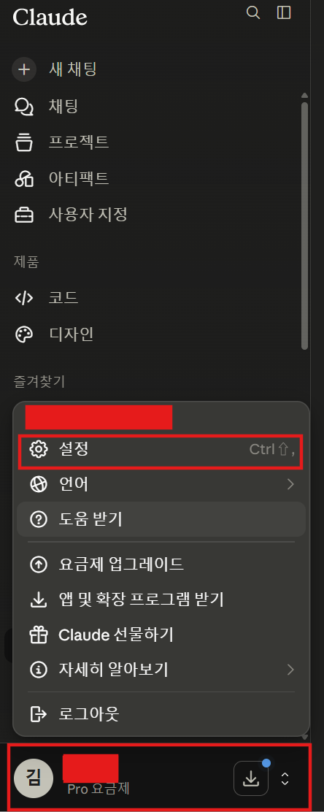
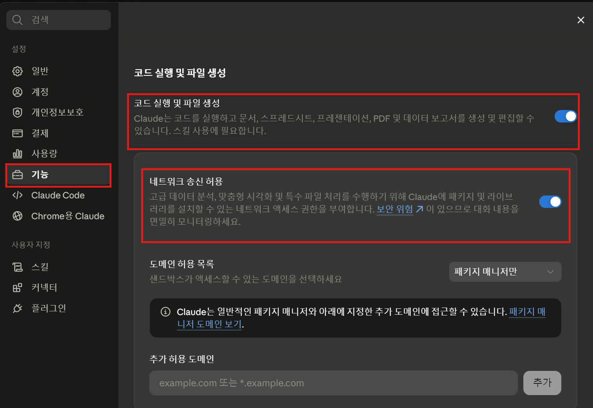

# Intro
최근에 고객사 프로젝트를 폐쇄망으로 진행하고 있었습니다. 폐쇄망에서 작업을 하다 보니 보안을 위해서 AI 사이트를 모두 막아놨더라구요?! 그러다 보니 뭔가 AI를 통해서 조사를 하거나 할 때 모바일로 접속해서 자료 조사를 시킵니다. 하지만 여기서 문제가 하나 생겼는데요... 모바일로 조사한 내용을 고객사의 사내 Confluence에 정리하거나 하는 부분이 필요한 경우가 있는데 이 내용을 어떻게 전달하고 나중에 프로젝트 이후에 어떻게 정리를 할까 하는 또 하나의 고민거리가 생겼습니다.
다행이 저희 회사의 Confluence Cloud로의 접근은 열어주셔서 자료를 참고할 수 있게 되었는데요 — 그래도 글 업로드는 안됩니다. 그래서 Claude에 저희 회사 Atlassian MCP를 붙여서 Confluence Cloud에 글을 적을 수 있도록 하면 되겠다 싶어 연결해서 지금은 잘 사용하고 있습니다.

이 글은 해당 작업을 한 내용을 기록하고자 작성하였습니다.

# Claude 에서 MCP 연결하기

## 다양한 MCP 서버를 제공 — 여러 벤더사의 노력?!
Claude에서는 다양한 MCP 서버를 제공하며 — 각 벤더들이 열심히 올리더군요 — 한번 연결을 해놓으면 모바일 환경에서도 연결해서 사용이 가능한데요 운이 좋게도 Atlassian 에서도 자신들의 Cloud 서버에 연결 가능한 MCP 서버를 등록을 해놓아서 이를 사용했습니다.

## 사전 작업 — Sandbox 기능 활성화
우선 제 목표는 Claude 웹 및 Claude 모바일 앱에서 사용하는 것이기에 MCP 기능을 사용하기 위한 몇 가지 기능을 켜야합니다 — Claude Code에서는 Approve만 하면 되는데 Claude Web 및 모바일 앱에서는 직접 기능을 켜줘야합니다.

우선 Claude 웹 혹은 모바일에서 "프로필(설정) -> 기능" 설정창에 들어갑니다.
<div style="max-width: 40%; margin: 0 auto;">



</div>

그 후 기능 -> 코드 실행 및 파일 생성에 들어가서 이를 활성화 하면
Claude에서 Sandbox 환경이 활성화 되며 간단한 프로그램 실행 — MCP 서버의 기동, 임시 파일로 작업 등... — 이 가능하게 됩니다.
***p.s 모바일보다 PC WEB 환경에서 설정이 좀 더 상세하게 가능함으로 Desktop web에서 설정 하는 것을 권장합니다.***


## MCP 연결

MCP 연결은 사실 비교적 간단합니다.  [Atlassian 공식 페이지](https://support.atlassian.com/atlassian-rovo-mcp-server/docs/getting-started-with-the-atlassian-remote-mcp-server/)에도 작성이 되어있는데요. 사실 해당 페이지에 작성된 프롬프트를 입력해도 되지만 그냥 간단하게 아래 프롬프트로도 연결이 가능합니다.

> Atlassian Cloud 환경의 Confluence에 MCP 서버를 통해 연결하고 싶어. 연결을 도와줄래?

이 정도의 프롬프트만으로도 연결이 됩니다. 이렇게 연결을 시도하게 되면 Atlassian 공식 MCP 서버를 아래와 같이 친절하게 찾아서 연결을 하겠냐고 물어봅니다.


여기서 사용을 누르고 나면 연결이 되며 몇 가지 인증 과정을 한 후 연결할 Site — Confluence Cloud에서는 하나의 계정에서 다양한 site를 구성하여 site 별로 별도의 Atlassian 제품들을 운영할 수 있습니다. —를 선택하고 나면 이제 연결되어서 사용이 가능합니다.

하지만 여기서 한 가지 함정이 있는데요 제 계정 정보 및 제가 어떤 Confluence의 Space — 현재는 Project라고 명칭이 바뀜 —에 접근하는지 이 녀석이 매번 찾는다는 문제점이 있습니다. 아무래도 다음과 같은 접근 방식 때문인 것으로 보입니다.

- accountId로 사용자 인식
- cloudId로 접근 사이트 인식
- spacekey로 최종 접근하고자 하는 space 접근

그렇다보니 대화 세션이 새로 시작될 때마다 제가 누구고 어떤 site의 어떤 페이지를 접근하려고 하는지 물어보더군요. 이렇게 하면 매번 물어보고 하면서 작업이 오래 걸리니까 전 이 부분을 조금 더 빠르게 진행하기 위해서 해당 부분을 스킬로 빼버렸습니다.

스킬의 구조는 대강 아래와 같습니다.
```plain
atlassian-workspace/
├── SKILL.md
└── references/
    ├── jira-projects.md
    └── confluence-spaces.md
```

메인 `SKILL.md`에서 스킬 전반의 지시사항을 다루고 `references`에서 제가 자주 사용하는 제품 별로 각각 설정 파일을 뒀습니다. 사실 저도 사내의 Confluence만 사용해서 Confluence만 좀 설정을 했는데 각 파일을 간단하게 요약하면 제가 자주 사용하는 Project, Space를 등록해서 빠르게 찾아가도록 해놓았습니다.

다음은 SKILL.md 파일 내용입니다. 
```markdown
---
name: atlassian-workspace
description: Youngwoo Kim(김영우)의 Atlassian 계정 정보와 기본 작업 사이트(sweplateer, cloudId 포함)를 제공해, Atlassian 작업을 할 때마다 계정·사이트를 다시 탐색하지 않고 곧바로 진행하도록 한다. 자주 쓰는 Jira 프로젝트와 Confluence 스페이스 목록 참조 파일도 안내한다. 사용자가 Atlassian / Jira / Confluence와 관련된 일을 요청하면 — 이슈 생성·검색·조회, Confluence 페이지 읽기·작성, 티켓·보드 확인 등 cloudId나 계정 식별이 필요한 모든 작업 — 사이트나 계정을 명시적으로 언급하지 않더라도 반드시 이 스킬을 사용한다.
---
 
# Atlassian 작업 환경 정보
 
사용자(Youngwoo Kim)의 Atlassian 작업을 도울 때 참고하는 고정 정보다.
목적은 매 작업마다 계정·사이트를 다시 탐색하느라 왕복하는 것을 막는 것이다.
Atlassian / Jira / Confluence 작업을 요청받으면, 아래 값을 **기본 전제로 바로 사용**한다.
 
## 내 계정
 
- 이름: Youngwoo Kim (김영우)
- 이메일: rdd0426@plateer.com
- accountId: `비밀`
- 타임존: Asia/Seoul
"내 이슈", "내가 담당한", "나에게 할당된" 처럼 사용자 본인을 가리키는 작업에서는
위 accountId를 사용한다(Jira에서는 보통 이메일보다 accountId가 더 정확하다).
 
## 기본 작업 사이트
 
- 사이트 이름: sweplateer
- URL: https://sweplateer.atlassian.net
- cloudId: `비밀`
- 권한: Jira(읽기/쓰기), Confluence(페이지·댓글 읽기/쓰기, 스페이스·검색 읽기)
현재 접근 가능한 사이트는 이곳 하나뿐이다. 따라서 cloudId가 필요한 모든 호출에는
위 cloudId를 그대로 사용하고, `getAccessibleAtlassianResources`나 `atlassianUserInfo`로
사이트·계정을 다시 조회하지 않는다.
 
## 재조회 및 갱신 규칙
 
평소에는 위 값을 그대로 쓰되, 다음 안전장치를 둔다.
 
1. **재조회 조건**: 위 값으로 작업이 실패하거나(예: cloudId 무효, 권한 오류),
   값이 더 이상 맞지 않는 정황이 보이면 그때는 재조회해도 좋다.
2. **확인 먼저**: 재조회로 새 값을 얻으면 곧바로 적용하지 말고,
   먼저 무엇이 어떻게 바뀌었는지 사용자에게 보여주고 확인을 받는다.
3. **갱신본 출력**: 사용자가 확인해주면, 이 SKILL.md의 "내 계정"과 "기본 작업 사이트"
   섹션을 갱신된 값으로 채운 **전체 블록**을 코드블록으로 다시 출력한다.
   사용자가 일부만 손으로 고치다 실수하지 않도록, 항상 통째로 덮어쓸 수 있는 형태로 준다.
## 자주 쓰는 프로젝트·스페이스 (참조 파일)
 
필요할 때만 아래 파일을 읽는다(매번 둘 다 읽을 필요는 없다).
 
- **Jira 프로젝트** 관련 작업(이슈 생성·검색·보드 등)을 할 때 →
  `references/jira-projects.md`를 읽어 자주 쓰는 프로젝트를 우선 후보로 삼는다.
- **Confluence 스페이스** 관련 작업(문서 검색·읽기·작성 등)을 할 때 →
  `references/confluence-spaces.md`를 읽어 자주 쓰는 스페이스를 우선 후보로 삼는다.
참조 파일의 항목이 비어 있거나 해당 작업에 맞는 것이 없으면,
평소처럼 사용자에게 묻거나 일반 검색/목록 조회로 진행한다.
 
```

다음은 `references`의 각각의 파일들입니다.

다음은 `confluence-spaces.md`입니다. 저도 현재는 제 개인 스페이스만 연결해서 사용중입니다.
```markdown
# 자주 쓰는 Confluence 스페이스
 
이 파일은 sweplateer 사이트(cloudId: `비밀`)에서
사용자가 자주 보는 Confluence 스페이스 목록과, "어떤 내용이 어디에 있는지" 메모다.
 
사용 규칙:
- 사용자가 "그 문서 찾아줘"처럼 위치를 특정하지 않고 자료를 찾으면, 사이트 전체를 막 검색하기 전에
  아래 목록·자료 위치 메모를 먼저 참고해 해당 스페이스부터 들여다본다.
- 비어 있거나 맞는 항목이 없으면, 평소처럼 일반 검색으로 진행한다.
- 채워지지 않은 placeholder 항목([...])은 무시한다.
## 스페이스 목록
 
- 스페이스 키: `비밀 ㅎㅎ` | 이름: Youngwoo Kim (개인 스페이스)
  - 용도: 본인이 공부/조사한 내용 정리(기술 조사, 트러블슈팅 메모 등). 개인 학습·리서치 자료를 저장할 때는 별다른 언급이 없어도 이 스페이스를 기본 후보로 우선 고려한다.
- 스페이스 키: [...] | 이름: [...]
  - 용도: [...]
## 자료 위치 메모 (어떤 내용이 어디에 있는지)
 
- [주제/자료]: [어디에 있는지. 예: 배포 절차 → ENG 스페이스 "Deployment Runbook" 페이지]
- [주제/자료]: [예: 스프린트 회고 → ENG 스페이스 "Retrospectives" 하위 페이지]
- [...]: [...]
<!--
스페이스 키는 Confluence URL의 /wiki/spaces/ENG/... 에서 "ENG" 부분이다.
자료 위치 메모는 "주제 → 위치" 형태로 자유롭게 추가하면 된다. 체감 효과가 가장 큰 부분이다.
-->
```

다음은 `jira-projects.md`의 템플릿입니다 — 사실 저도 사내 Jira는 잘 사용하지 않습니다. 
```markdown
# 자주 쓰는 Jira 프로젝트
 
이 파일은 sweplateer 사이트(cloudId: `비밀`)에서
사용자가 자주 다루는 Jira 프로젝트 목록이다.
 
사용 규칙:
- 사용자가 Jira 작업을 요청했는데 프로젝트를 특정하지 않았다면, 아래 목록을 우선 후보로 삼는다.
- 목록이 하나뿐이면 그 프로젝트로 가정하되, 쓰기 작업(이슈 생성 등) 전에는 가볍게 한 번 확인한다.
- 비어 있거나 맞는 항목이 없으면, 평소처럼 사용자에게 묻거나 프로젝트 목록을 조회한다.
- 채워지지 않은 placeholder 항목([...])은 무시한다.
## 프로젝트 목록
 
- 프로젝트 키: [예: SWE] | 이름: [예: SWE Platform]
  - 용도: [이 프로젝트에서 주로 무슨 작업을 하는지. 예: 백엔드 기능 개발 이슈]
  - 기본값: [반복되는 설정. 예: 이슈 생성 시 기본 담당자는 나(accountId 비밀)]
- 프로젝트 키: [...] | 이름: [...]
  - 용도: [...]
  - 기본값: [...]
<!--
프로젝트 키는 이슈 번호 앞에 붙는 약자다 (예: SWE-123 의 "SWE").
새 프로젝트를 추가할 때 위 형식을 그대로 복사해서 채우면 된다.
-->
```

이 정도로 설정하고 나서 간단하게 테스트를 해보면?? 아래와 같이 작업 중에 스킬을 자동으로 찾아서 사용한 흔적이 발견되었네요.


## MCP 연결하고 끝? — connector 설정 필수
사실 위처럼 설정하고 끝! 일 것 같지만 현실은 그렇지 않습니다.
분명히 처음 Atlassian MCP 설치하고 처음 접근 허용을 해줄 때 "항상 허용"을 해주었음에도 사용하다 보면 대화 세션이 바뀔때마다 계속 권한을 물어는 기이한 현상을 경험할 수 있습니다.

그럼 어떻게 해결할 수 있나?? 사실 Connector 설정을 따로 해주셔야합니다.
아까 처럼 설정에 들어오면 사용자 지정 -> 커넥터 로 들어간 후 Atlassian Rovo 커넥터를 선택합니다.


그러고 나면 아래와 같이 다양한 권한이 나열된 설정을 마주할 수 있습니다.
그중에서 전 Confluence에 글 작성하는 작업을 항상 허용해주고 싶으니 Create Confluence Page를 항상 허용하도록 설정했습니다.


이렇게 하고나면 이제 대화 세션이 바뀌거나 하더라도 더 이상 저에게 귀찮게 물어보지 않습니다!!

사실 항상 허용하는 것 보다는 글을 수정/삭제/생성 하는 부분은 항상 승인을 요청하는 방식이 좋긴 안전하지만... 인트로에서 다룬것처럼 전 모바일에서 사용하는 경우가 잦고? 그 모바일 환경에서는 승인 창 자체가 아직 구현되지 않아 나오지 않습니다. 추후에 만약 승인 부분이 제대로 모바일에서도 구현이 된다면 다시 "승인 필요"로 바꾸지 않을까 싶습니다.

# 결론
이렇게 글 전반에서 Claude Web/모바일 환경을 위한 Confluence Cloud를 MCP 서버를 통해서 연결하도록 설정해보았습니다. 사실 Confluence라고 했지만 Notion이든 다른 제품들이든 웬만하면 연결하는 방식 자체는 유사한 것 같더라구요 — Notion은 유사했었습니다.

제가 남기고자 한 글의 핵심은 단순히 MCP를 설정하고 끝이 아니라 그 이후에 토큰 절약 및 작업의 속도를 올리기 위해서 저처럼 스킬 형태로 스페이스를 작성하고 그 내부 구조를 어느정도 가이드 준다면 더욱 수월한 작업을 할 수 있다는 점입니다.

# 개선점 — TODO List

추가적으로 이후에 개선해보고자 하는 점은 제 Confluence 개인 스페이스를 AI 친화적인 구조로 바꾸는 것입니다.

Atlassian Rovo MCP를 보면 Rovo가 JQL 쿼리를 통해서 검색을 하거나 글의 내용을 뒤져서 페이지를 찾는 것을 알 수 있습니다 — Confluence에서는 첨부 문서 내용 및 페이지의 내용으로도 검색이 됩니다. 그래서 AI가 조금 더 잘 찾을 수 있도록 글들을 정리하고 글의 힌트를 주고자 아래와 같은 작업을 하고자 합니다.
- 페이지 구조 정하기 : 페이지 구조를 정하고 SKILL에 이를 반영하여 글을 찾기 쉽도록 하고자 합니다.
- Label 달기 : 글의 내용과 연관된 Label을 달아서 검색을 더 잘 하도록 하고자 합니다.
- 쓸 데 없는 글 정리 : 쓸 데 없는 글 및 첨부 파일들이 많으면 보기도 지저분하고 AI가 쓸데없는 글을 보느라 토큰, 시간 낭비가 심할 것으로 생각되어 정리하고자 합니다.